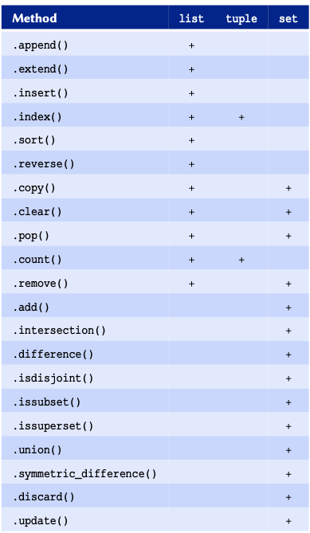
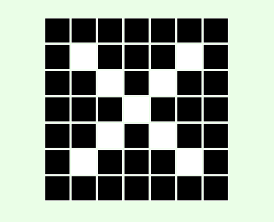
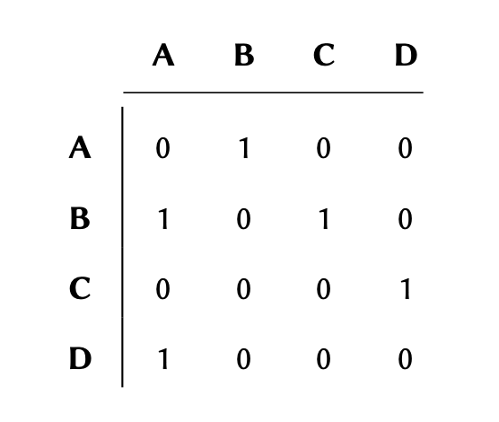

[**Download Chapter pdf**](04-arrays.md.pdf)

[**Download Chapter notebook (ipynb)**](04-arrays.ipynb)

[<span style="color: rgb(255, 0, 0);">**Mandatory Lesson Feedback Survey**</span>](https://docs.google.com/forms/d/e/1FAIpQLSdr0capF7jloJhPH3Pki1B3LZoKOG16poOpuVJ7SL2LkwLHQA/viewform?pli=1)

:::::::::::::::::::::::::::::::::::::: questions 

- What are different types of arrays?
- How is data stored and retrieved from an array
- Why nested arrays?
- What are tuples?

::::::::::::::::::::::::::::::::::::::::::::::::
 
::::::::::::::::::::::::::::::::::::: objectives
- Understanding difference between lists and tuples.
- Building concepts of operations on arrays.
- knowing storing multidimensional data.
- Understanding mutability and immutability.
::::::::::::::::::::::::::::::::::::::::::::::::

<br>
<p align = "center">
<iframe width="560" height="315" src="https://www.youtube.com/embed/RlhGPZv8fZI" title="YouTube video player" frameborder="0" allow="accelerometer; autoplay; clipboard-write; encrypted-media; gyroscope; picture-in-picture" allowfullscreen></iframe>
</p>
<br>
<p align = "center">
<iframe width="560" height="315" src="https://www.youtube.com/embed/KiMQiN4CN8s" title="YouTube video player" frameborder="0" allow="accelerometer; autoplay; clipboard-write; encrypted-media; gyroscope; picture-in-picture" allowfullscreen></iframe>
</p>
<br>
<p align = "center">
<iframe width="560" height="315" src="https://www.youtube.com/embed/id72qTBmCEY" title="YouTube video player" frameborder="0" allow="accelerometer; autoplay; clipboard-write; encrypted-media; gyroscope; picture-in-picture" allowfullscreen></iframe>
</p>
<br>

:::::::::::::::::: prereq
- [Variables and Types](02-input_output.Rmd#varTypes)
- [Logical Operations](02-input_output.Rmd#subsec:logicalOperatons)
- [Conditional Statements](03-conditional_statements.Rmd)


:::::::::::::::::: 

<p style='text-align: justify;'> 
So far, we have been using variables to store individual values. In some circumstances, we may need to access multiple values to perform operations. In such occasions, defining a variable for every single value can become very tedious. To address this, we use arrays. 
</p>

<p style='text-align: justify;'> 
Arrays are variables that hold any number of values. Python provides 3 types of built-in arrays: ```list```, ```tuple```, and ```set```. There are a several common features amongst all arrays in Python; however, each type of array enjoys its own range of unique features that facilitate specific operations. 
</p>

:::::::::::::::::::::::::::::::::::: callout
## Remember	
Each item inside an array may be referred to as a *member* or *item* of that array.
	
:::::::::::::::::::::::::::::::::::: 

## Lists
[**Resource for Lists**](https://docs.python.org/3/tutorial/datastructures.html\#more-on-lists)

<p style='text-align: justify;'> 
Lists are the most frequently used type of arrays in Python. It is therefore important to understand how they work, and that how can we use them and features they offer to our advantage.
</p>

<p style='text-align: justify;'> 
The easiest way to imagine how a ```list``` works is to think of it as a table that can have any number of rows. This is akin to a spreadsheet with one column. For instance, suppose we have a table with 4 rows in a spreadsheet application as follows:
</p>


The number of rows in an array determine the *length.* The above table has 4 rows; therefore it is said to have a *length* of 4. 


### **Implementation**

:::::::::::::::::::::::::::::::::::: callout
## Remember	
To implement a ```list``` in Python, we place the values separated by commas inside square brackets <span style="color: rgb(32, 121, 77);">[1, 2, 3, ...]</span>.
	
:::::::::::::::::::::::::::::::::::: 


```python
table = [5, 21, 5, -1]
	
print(table)
```

```{.output}
[5, 21, 5, -1]
```


```python

print(type(table))
```

```{.output}
<class 'list'>
```

::::::::::::::::::::::::::::::: challenge 

## Do it Yourself {#diy:array:list:fibonacci}

Implement a ```list``` array called <span style="color: rgb(32, 121, 77);">fibonacci</span>, whose members represent the first 8 numbers of the [Fibonacci sequence](https://en.wikipedia.org/wiki/Fibonacci_number) as follows:

| FIBONACCI NUMBERS (FIRST 8) |   |   |   |   |   |    |    |
|:---------------------------:|:---:|:---:|:---:|:---:|:---:|:---:|:---:|
| 1 | 1 | 2 | 3 | 5 | 8 | 13 | 21 |

	
::::::::::::::::: solution
	
## DIY ANSWER


```python
fibonacci = [1, 1, 2, 3, 5, 8, 13, 21]
```

:::::::::::::::::

::::::::::::::::::::::::::::::: 


### **Indexing** {#sec:list:indexing}

In arrays, an index is an integer number that corresponds to a specific item. 

<p style='text-align: justify;'> 
You can think of an index as a *unique reference* or a *key* that corresponds to a specific row in a table. We don't always write the row number when we create a table. However, we always know that the 3^rd^ row of a table means that we start from the first row (row \#1), count 3 rows down and there we find the 3^rd^ row. 
</p>

<p style='text-align: justify;'> 
The only difference in Python is that we don't take the first row as row \#1; instead, we consider it to be row \#0. As a consequence of starting from \#0, we count rows in our table down to row \#2 instead of \#3 to find the 3^rd^ row. So our table may in essence be visualised as follows:
</p>


::::::::::::::::::::::::::::::::::: callout
## Remember	
Python uses a zero-based indexing system. This means that the first row of an array, regardless of its type, is always \#0.
	
::::::::::::::::::::::::::::::::::: 

With that in mind, we can use the index for each value to retrieve it from a ```list```. 

Given a ```list``` of 4 members stored in a variable called <span style="color: rgb(32, 121, 77);">table</span>:

```
table = [5, 21, 5, -1]
```

we can visualise the referencing protocol in Python as follows:

<p style='text-align: justify;'> 
As demonstrated in the diagram; to retrieve a member of an array through its index, we write the name of the variable immediately followed by the index value inside a pair of square brackets --- *e.g.* <span style="color: rgb(32, 121, 77);">table[2]</span>.
</p>


```python
print(table[2])
```

```{.output}
5
```


```python
print(table[0])
```

```{.output}
5
```


```python
item = table[3]
	
print(item)
```

```{.output}
-1
```
	
::::::::::::::::::::::::::::::: challenge 

## Do it Yourself

Retrieve and display the 5^th^ Fibonacci number from the ```list``` you created in previous [DIY](#diy:array:list:fibonacci).
	
	
::::::::::::::::: solution
	
## DIY ANSWER


```python
print(fibonacci[4])
```

```{.output}
5
```
:::::::::::::::::

::::::::::::::::::::::::::::::: 

<p style='text-align: justify;'> 
It is sometimes more convenient to index an array backwards --- that is, to reference the members from the bottom of the array. This is called *negative indexing* and is particularly useful when we are dealing with very lengthy arrays. The indexing system in Python support both positive and negative indexing systems.
</p>

The table above therefore may also be represented as follows:


:::::::::::::::::::::::::::::::::::: callout
## Remember	
Unlike the normal indexing system, which starts from \#0, negative indexes start from \#-1 so that it will always be clear which indexing system is being used.
	
:::::::::::::::::::::::::::::::::::: 

If the index is a negative number, the indices are counted from the end of the ```list```. We can implement negative indices the same way we do positive ones:


```python
print(table[-1])
```

```{.output}
-1
```


```python
print(table[-2])
```

```{.output}
5
```


```python
print(table[-3])
```

```{.output}
21
```


We know that in <span style="color: rgb(32, 121, 77);">table</span>, index \#-3 refers the same value as index \#1. So let us go ahead and test this:


```python
equivalence = table[-3] == table[1]
	
print(equivalence)
```

```{.output}
True
```


If the index requested is larger than the length of the ```list``` minus one, an ```IndexError``` will be raised:


```python
print(table[4])
```

```{.error}
Error in py_call_impl(callable, dots$args, dots$keywords): IndexError: list index out of range

Detailed traceback:
  File "<string>", line 1, in <module>
```

:::::::::::::::::::::::::::::::::::: callout
## Remember	
The values stored in a ```list``` may be referred to as the **members** of that ```list```.
	
:::::::::::::::::::::::::::::::::::: 

::::::::::::::::::::::::::::::: challenge 

## Do it Yourself

Retrieve and display the *last* Fibonacci number from the ```list``` you created in [DIY](#diy:array:list:fibonacci).
	
	
::::::::::::::::: solution
	
## DIY ANSWER

```python
print(fibonacci[-1])
```

```{.output}
21
```

:::::::::::::::::

::::::::::::::::::::::::::::::: 


### **Slicing** {#sec:list:slicing}

We may retrieve more than one value from a ```list``` at a time, as long as the values are in *consecutive* rows. This process is known as \emph{slicing}, and may be visualised as follows:


:::::::::::::::::::::::::::::::::::: callout
## Remember	
Python is a **non-inclusive** language. This means that in <span style="color: rgb(32, 121, 77);">table[a:b]</span>, a *slice* includes all the values from, and including index <span style="color: rgb(32, 121, 77);">a</span> right down to, but *excluding*, index <span style="color: rgb(32, 121, 77);">b</span>.
	
:::::::::::::::::::::::::::::::::::: 

Given a ```list``` representing the above table:

```
table = [5, 21, 5, -1]
```

we may retrieve a slice of <span style="color: rgb(32, 121, 77);">table</span> as follows:


```python
my_slice = table[1:3]
	
print(my_slice)
```

```{.output}
[21, 5]
```

```{}
print(table[0:2])
```

If the first index of a slice is \#0, the slice may also be written as:


```python
print(table[:2])
```

```{.output}
[5, 21]
```

Negative slicing is also possible:


```python
# Retrieves every item from the first member down
# to, but excluding the last one:
print(table[:-1])
```

```{.output}
[5, 21, 5]
```


```python
print(table[1:-2])
```

```{.output}
[21]
```

If the second index of a slice represents the last index of a ```list```, it be written as:

```python
print(table[2:])
```

```{.output}
[5, -1]
```


```python
print(table[-3:])
```

```{.output}
[21, 5, -1]
```

We may store indices and slices in variables:


```python
start, end = 1, 3
new_table = table[start:end]

print(new_table)
```

```{.output}
[21, 5]
```


The <kbd>slice()</kbd> function may also be used to create a slice variable:

```python
my_slice = slice(1, 3)
	
print(table[my_slice])
```

```{.output}
[21, 5]
```

::::::::::::::::::::::::::::::: challenge 

## Do it Yourself
<p style='text-align: justify;'> 
Retrieve and display a slice of Fibonacci numbers from the ```list``` you created in [DIY](#diy:array:list:fibonacci) that includes all the members from the 2nd number onwards --- *i.e*.  the slice must not include the first value in the ```list```.
</p>	
	
::::::::::::::::: solution
	
## DIY ANSWER


```python
print(fibonacci[1:])
```

```{.output}
[1, 2, 3, 5, 8, 13, 21]
```

:::::::::::::::::

::::::::::::::::::::::::::::::: 

:::::::::::::::::::::::::::::::::::: callout
## Note
<p style='text-align: justify;'> 
**Methods** are features of [Object-Oriented Programming (OOP)](https://en.wikipedia.org/wiki/Object-oriented_programming), a programming paradigm that we do not discuss in the context of this course. You can think of a *method* as a *function* that is associated with a specific *type*. The job of a *method* is to provide a certain functionality unique to the *type* it is associated with. In this case, ```.index()``` is a *method* of type ```list``` that given a value, finds and produces its index from the ```list```.
</p>

:::::::::::::::::::::::::::::::::::: 


### **From value to index**

Given a ```list``` entitled <span style="color: rgb(32, 121, 77);">table</span> as:


```python
table = [5, 21, 5, -1]
```


we can also find out the index of a specific value. To do so, we use the <kbd>.index()</kbd> *method*:


```python
print(table.index(21))
```

```{.output}
1
```


```python
last_item = table.index(-1)
	
print(last_item)
```

```{.output}
3
```


If a value is repeated more than once in the  ```list```, the index corresponding to the *first* instance of that value is returned:

```python
print(table.index(5))
```

```{.output}
0
```

If a value does *not* exist in the ```list```, using <kbd>.index()</kbd> will raise a ```ValueError```:


```python
print(table.index(9))
```

```{.error}
Error in py_call_impl(callable, dots$args, dots$keywords): ValueError: 9 is not in list

Detailed traceback:
  File "<string>", line 1, in <module>
```


::::::::::::::::::::::::::::::: challenge 

## Do it Yourself

Find and display the index of these values from the ```list``` of Fibonacci numbers that you created in [DIY](#diy:array:list:fibonacci):

* 1
* 5
* 21

	
::::::::::::::::: solution
	
## DIY ANSWER


```python
print(fibonacci.index(1))
		
```

```{.output}
0
```

```python
print(fibonacci.index(5))
		
```

```{.output}
4
```

```python
print(fibonacci.index(21))
```

```{.output}
7
```

:::::::::::::::::

::::::::::::::::::::::::::::::: 

### **Mutability** {#subsubsec:list:mutability}
<p style='text-align: justify;'> 
Arrays of type ```list``` are modifiable. That is, we can add new values, change the existing ones, or remove them from the array all together. Variable types that allow their contents to be modified are referred to as *mutable types* in programming. 
</p>

#### **Addition of new members**

Given a ```list``` called <span style="color: rgb(32, 121, 77);">table</span> as:

\begin{lstlisting} 
	table = [5, 21, 5, -1]
\end{lstlisting}

We can add new values to <span style="color: rgb(32, 121, 77);">table</span> using <kbd>.append()</kbd>:


```python
table.append(29)
	
print(table)
```

```{.output}
[5, 21, 5, -1, 29]
```


```python
table.append('a text')
	
print(table)
```

```{.output}
[5, 21, 5, -1, 29, 'a text']
```

<p style='text-align: justify;'> 
Sometimes, it may be necessary to insert a value at a specific index in a ```list```. To do so, we may use <kbd>.insert()</kbd>, which takes two input arguments; the first representing the index, and the second the value to be inserted:
</p>


```python
table.insert(3, 56)
	
print(table)
```

```{.output}
[5, 21, 5, 56, -1, 29, 'a text']
```

::::::::::::::::::::::::::::::: challenge 

## Do it Yourself

Given <span style="color: rgb(32, 121, 77);">fibonacci</span> the ```list``` representing the first 8 numbers in the Fibonacci sequence that you created in [DIY](#diy:array:list:fibonacci):

1. The 10^th^ number in the Fibonacci sequence is 55. Add this value to <span style="color: rgb(32, 121, 77);">fibonacci</span>.
	
2. Now that you have added 55 to the ```list```, it no longer provides a correct representation of the Fibonacci sequence. Alter <span style="color: rgb(32, 121, 77);">fibonacci</span> and insert the missing number such that your it correctly represents the first 10 numbers in the Fibonacci sequence, as follows:


| FIBONACCI NUMBERS (FIRST 8) |   |   |   |   |   |    |    |   |   |
|:---------------------------:|:---:|:---:|:---:|:---:|:---:|:---:|:---:|:---:|:---:|
| 1 | 1 | 2 | 3 | 5 | 8 | 13 | 21 | 34 | 55 |

::::::::::::::::: solution
	
## Q1

```python
fibonacci.append(55)
```

:::::::::::::::::

::::::::::::::::: solution
	
## Q2

```python
fibonacci.insert(8, 34)
```

:::::::::::::::::

::::::::::::::::::::::::::::::: 

#### **Modification of members**

Given a ```list``` as:


```python
table = [5, 21, 5, 56, -1, 29, 'a text']
```

We can also modify the exiting value or values inside a ```list```. This process is sometimes referred to as *item assignment*:


```python
# Changing the value of the 2nd member.

table[1] = 174
	
print(table)
```

```{.output}
[5, 174, 5, 56, -1, 29, 'a text']
```


```python
table[-4] = 19
	
print(table)
```

```{.output}
[5, 174, 5, 19, -1, 29, 'a text']
```

<p style='text-align: justify;'> 
It is also possible to perform *item assignment* over a *slice* containing any number of values. Note that when modifying a slice, the replacement values must be the same length as the slice we are trying to replace:
</p>


```python
print('Before:', table)
	
```

```{.output}
Before: [5, 174, 5, 19, -1, 29, 'a text']
```

```python
replacement = [-38, 0]
	
print('Replacement length:', len(replacement))
```

```{.output}
Replacement length: 2
```

```python
print('Replacement length:', len(table[2:4]))
	
# The replacement process:
```

```{.output}
Replacement length: 2
```

```python
table[2:4] = replacement
	
print('After:', table)
```

```{.output}
After: [5, 174, -38, 0, -1, 29, 'a text']
```


```python
# Using the existing value to determine the new value:
table[2] = table[2] + 50
	
print(table)
```

```{.output}
[5, 174, 12, 0, -1, 29, 'a text']
```


::::::::::::::::::::::::::::::: challenge 

## Do it Yourself

Given a ```list``` containing the first 10 [prime numbers](https://en.wikipedia.org/wiki/Prime_number) as:

```
primes = [2, 3, 5, 11, 7, 13, 17, 19, 23, 29]
	
```	
<p style='text-align: justify;'> 
However, values 11 and 7 have been misplaced in the sequence. Correct the order by replacing the slice of <span style="color: rgb(32, 121, 77);">primes</span> that represents <span style="color: rgb(32, 121, 77);">[11, 7]</span> with <span style="color: rgb(32, 121, 77);">[7, 11]</span>.
</p>

::::::::::::::::: solution
	
## DIY ANSWER


```python
primes = [2, 3, 5, 11, 7, 13, 17, 19, 23, 29]

primes[3:5] = [7, 11]
```
:::::::::::::::::

::::::::::::::::::::::::::::::: 

#### **Removal of members**
<p style='text-align: justify;'> 
When removing a value from a ```list``` array, we have two options depending on our needs: we either remove the member and retain the value in another variable, or we remove it and dispose of the value.
</p>

<p style='text-align: justify;'> 
To remove a value from a ```list``` without retaining it, we use <kbd>.remove()</kbd>. The method takes one input argument, which is the value we would like to remove from our ```list```:
</p>


```python
table.remove(174)
	
print(table)
```

```{.output}
[5, 12, 0, -1, 29, 'a text']
```


Alternatively, we can use <kbd>del</kbd>; a Python syntax that we can use in this context to delete a specific member using its index: 


```python
del table[-1]
	
print(table)
```

```{.output}
[5, 12, 0, -1, 29]
```
<p style='text-align: justify;'> 
As established above, we can also delete a member and retain its value. Of course we can do so by holding the value inside another variable before deleting it. 
</p>
<p style='text-align: justify;'> 
Whilst that is a valid approach, Python's ```list``` provide us with <kbd>.pop()</kbd> to simplify the process even further. The method takes one input argument for the index of the member to be removed. It removes the member from the ```list``` and returns its value, so that we can retain it in a variable:
</p>


```python
removed_value = table.pop(2)
	
print('Removed value:', removed_value)
```

```{.output}
Removed value: 0
```

```python
print(table)
```

```{.output}
[5, 12, -1, 29]
```

::::::::::::::::::::::::::::::: challenge 

## Do it Yourself

We know that the nucleotides of DNA include <span style="color: rgb(32, 121, 77);">A</span>, <span style="color: rgb(32, 121, 77);">C</span>, <span style="color: rgb(32, 121, 77);">T</span>, and <span style="color: rgb(32, 121, 77);">G</span>. 
	
Given a ```list``` representing the nucleotides of a DNA strand as:
	
``` 
strand = ['A', 'C', 'G', 'G', 'C', 'M', 'T', 'A']
```

1. Find the index of the invalid nucleotide in <span style="color: rgb(32, 121, 77);">strand</span>.

2. Use the index you found to remove the invalid nucleotide from <span style="color: rgb(32, 121, 77);">strand</span> and retain the value in another variable. 
Display the result as: 

```
Removed from the strand: X
New strand: [X, X, X, ...] 
```

3. What do you think happens once we run the following code, and why? What would be the final result displayed on the screen?

```
strand.remove('G')
			
print(strand)
```
	
::::::::::::::::: solution
	
## Q1


```python
strand = ['A', 'C', 'G', 'G', 'C', 'M', 'T', 'A']

outlier_index = strand.index('M')
	
```
:::::::::::::::::

::::::::::::::::: solution
	
## Q2


```python
outlier_value = strand.pop(outlier_index)
		
print('Removed from the strand:', outlier_value)
```

```{.output}
Removed from the strand: M
```

```python
print('New strand:', strand)
	
```

```{.output}
New strand: ['A', 'C', 'G', 'G', 'C', 'T', 'A']
```
:::::::::::::::::

::::::::::::::::: solution
	
## Q3

One of the two <span style="color: rgb(32, 121, 77);">G</span> nucleotides, the one at index 2 of the original array, is removed. This means that the <kbd>.remove()</kbd> method removes only *first* instance of a member in an array. The output would therefore be:

```
['A', 'C', 'G', 'C', 'M', 'T', 'A']
```
:::::::::::::::::
::::::::::::::::::::::::::::::: 

#### **Method--mediated operations**
<p style='text-align: justify;'> 
We already know that *methods* are akin to functions that are associated with a specific type. In this subsection, we will be looking into how operations are performed using *methods*. To that end, we will not be introducing anything new, but recapitulate what we already know from different perspectives.
</p>

<p style='text-align: justify;'> 
So far in this chapter, we have learned how to perform different operations on ```list``` arrays in Python. You may have noticed that some operations return a result that we can store in a variable, whilst others change the original value. 
</p>
With that in mind, we can divide operations performed using *methods* into two general categories:

1. Operations that return a result *without* changing the original array:
	

```python
table = [1, 2, 3, 4]
		
index = table.index(3)
		
print(index)
```

```{.output}
2
```

```python
print(table)
```

```{.output}
[1, 2, 3, 4]
```
	

2. Operations that use specific **methods** to *change* the original array, but do *not* necessarily return anything (in-place operations):
	

```python
table = [1, 2, 3, 4]

table.append(5)
		
print(table)
```

```{.output}
[1, 2, 3, 4, 5]
```

	
If we attempt to store the output of an operation that does not a return result inside a variable, the variable will be created, but its value will be set to ```None```:


```python
result = table.append(6)
		
print(result)
```

```{.output}
None
```

```python
print(table)
```

```{.output}
[1, 2, 3, 4, 5, 6]
```


It is important to know the difference between these types of operations. So as a rule of thumb, when we use *methods* to perform an operation, we can only change the original value if it is an instance of a *mutable* type. See [Table](02-input_output.Rmd#fig:nativeTypes) to find out which built-in types are mutable in Python. 

The *methods* that are associated with *immutable* objects always return the results and do not provide the ability to alter the original value:

* In-place operation on a *mutable* object of type ```list```:


```python
table = [5, 6, 7]
		
table.remove(6)
		
print(table)
```

```{.output}
[5, 7]
```


* In-place operation on an *immutable* object of type ```str```:


```python
string = '567'
		
string.remove(20)
		
```

```{.error}
Error in py_call_impl(callable, dots$args, dots$keywords): AttributeError: 'str' object has no attribute 'remove'

Detailed traceback:
  File "<string>", line 1, in <module>
```

```python
print(string)
```

```{.output}
567
```

* Normal operation on a *mutable* object of type ```list```:


```python

table = [5, 6, 7]
		
ind = table.index(6)
		
print(ind)
```

```{.output}
1
```

* Normal operation on a *mutable* object of type ```list```:


```python
string = '567'
		
ind = string.index('6')
		
print(ind)
```

```{.output}
1
```


### **List members**{#listMem}
<p style='text-align: justify;'> 
A ```list``` is a collection of members that are independent of each other. Each member has its own [type](02-input_output.Rmd#varTypes), and is therefore subject to the properties and limitation of that type:
</p>


```python
table = [1, 2.1, 'abc']
	
print(type(table[0]))
```

```{.output}
<class 'int'>
```

```python
print(type(table[1]))
```

```{.output}
<class 'float'>
```

```python
print(type(table[2]))
```

```{.output}
<class 'str'>
```
<p style='text-align: justify;'> 
For instance, mathematical operations may be considered a feature of all numeric types demonstrated in [Table](02-input_output.Rmd#fig:nativeTypes). However, unless in specific circumstance described in subsection [Non-numeric values](02-input_output.Rmd#subsubsec:mathematicalOperations:nonNumerics), such operations do not apply to instance of type ```str```.
</p>


```python
table = [1, 2.1, 'abc']
	
table[0] += 1
table[-1] += 'def'
	
print(table)
```

```{.output}
[2, 2.1, 'abcdef']
```
<p style='text-align: justify;'> 
Likewise, the ```list``` plays the role of a container that may incorporate any number of values. Thus far, we have learned how to handle individual members of a ```list```. In this subsection, we will be looking at several techniques that help us address different circumstances where we look at a ```list``` from a 'wholist' perspective; that is, a container whose members are unknown to us. 
</p>

#### **Membership test**
[**Membership test operations [advanced]**](https://docs.python.org/3/reference/expressions.html\#membership-test-operations)

We can check to see whether or not a specific value is a member of a ```list``` using the operator syntax <kbd>in</kbd>:


```python
items = [1, 2.4, 'John', 5, 4]

print(2.4 in items)
```

```{.output}
True
```


```python
print(3 in items)
```

```{.output}
False
```

The results may be stored in a variable:

```python
has_five = 5 in items

print(has_five)
```

```{.output}
True
```
	
Similar to any other [logical expression](02-input_output.Rmd#subsec:logicalOperatons), we can [negate](02-input_output.Rmd#sec:logicalStatements:Negation) membership tests by using \texttt{not in}:


```python
expr = 10 not in items
	
print(expr)  
```

```{.output}
True
```


```python
expr = 5 not in items
	
print(expr)  
```

```{.output}
False
```

:::::::::::::::::::::::::::::::::::: callout
## Remember	

When testing against ```str values``` --- *i.e.* text; don't forget that in programming, operations involving texts are *always* case-sensitive.	


```python
items = [1, 2.4, 'John', 5, 4]
		
john_capital = 'John'
john_small = 'john'
		
print(john_capital in items)
```

```{.output}
True
```

```python
print(john_small in items)
```

```{.output}
False
```
:::::::::::::::::::::::::::::::::::: 

For *numeric* values, ```int``` and ```float``` may be used interchangeably:


```python
print(4 in items)
```

```{.output}
True
```


```python
print(4.0 in items)
```

```{.output}
True
```


Similar to other [logical expression](02-input_output.Rmd#subsec:logicalOperatons), membership tests may be incorporated into conditional statements:


```python
if 'John' in items:
    print('Hello John')
else:
    print('Hello')
```

```{.output}
Hello John
```

::::::::::::::::::::::::::::::: challenge 

## Do it Yourself {#diy:arrays:list:randomPeptides}

Given a ```list``` of randomly generated peptide sequences as:


```python
peptides = [
  'FAEKE', 'DMSGG', 'CMGFT', 'HVEFW', 'DCYFH', 'RDFDM', 'RTYRA', 
  'PVTEQ', 'WITFR', 'SWANQ', 'PFELC', 'KSANR', 'EQKVL', 'SYALD', 
  'FPNCF', 'SCDYK', 'MFRST', 'KFMII', 'NFYQC', 'LVKVR', 'PQKTF', 
  'LTWFQ', 'EFAYE', 'GPCCQ', 'VFDYF', 'RYSAY', 'CCTCG', 'ECFMY', 
  'CPNLY', 'CSMFW', 'NNVSR', 'SLNKF', 'CGRHC', 'LCQCS', 'AVERE', 
  'MDKHQ', 'YHKTQ', 'HVRWD', 'YNFQW', 'MGCLY', 'CQCCL', 'ACQCL'
  ]
```
Determine whether or not each of the following sequences exist in <span style="color: rgb(32, 121, 77);">peptides</span>; and if so, what is their corresponding index:


* <span style="color: rgb(32, 121, 77);">IVADH</span>
* <span style="color: rgb(32, 121, 77);">CMGFT</span>
*	<span style="color: rgb(32, 121, 77);">DKAKL</span>
* <span style="color: rgb(32, 121, 77);">THGYP</span>
* <span style="color: rgb(32, 121, 77);">NNVSR</span>


Display the results in the following format:
	
```
Sequence XXXXX was found at index XX
```
::::::::::::::::: solution
	
## Q1


```python
sequence = "IVADH"
if sequence in peptides:
    index = peptides.index(sequence)
    print('Sequence', sequence, 'was found at index',  index)
    
```
:::::::::::::::::

::::::::::::::::: solution
	
## Q2


```python
sequence = "CMGFT"
if sequence in peptides:
    index = peptides.index(sequence)
    print('Sequence', sequence, 'was found at index',  index)
    
```

```{.output}
Sequence CMGFT was found at index 2
```
:::::::::::::::::

::::::::::::::::: solution
## Q3


```python
sequence = "DKAKL"
if sequence in peptides:
    index = peptides.index(sequence)
    print('Sequence', sequence, 'was found at index',  index)
    
```
:::::::::::::::::

::::::::::::::::: solution
## Q4


```python
sequence = "THGYP"
if sequence in peptides:
    index = peptides.index(sequence)
    print('Sequence', sequence, 'was found at index',  index)
```
:::::::::::::::::

::::::::::::::::: solution
## Q5


```python
sequence = "NNVSR"
if sequence in peptides:
    index = peptides.index(sequence)
    print('Sequence', sequence, 'was found at index',  index)
```

```{.output}
Sequence NNVSR was found at index 30
```
:::::::::::::::::

::::::::::::::::::::::::::::::: 

#### **Length**

[**Built-in functions: len**](https://docs.python.org/3.6/library/functions.html\#len)
<p style='text-align: justify;'>
The number of members contained within a ```list``` defines its length. Similar to the length of ```str``` values as discussed in [mathematical operations](02-input_output.Rmd#math_ops) [DIY-I](02-input_output.Rmd#diy:mathsI) and [DIY-IV](02-input_output.Rmd#diy:mathOpts:Huntington), we use the built-in function <kbd>len()</kbd> also to determine the length of a ```list```:
</p>


```python
items = [1, 2.4, 'John', 5, 4]
	
print(len(items))
```

```{.output}
5
```


```python
print(len([1, 5, 9]))
```

```{.output}
3
```
<p style='text-align: justify;'>
The <kbd>len()</kbd> function *always* returns an integer value (```int```) equal to or greater than zero. We can store the length in a variable and use it in different [mathematical](02-input_output.Rmd#math_ops) or [logical](02-input_output.Rmd#subsec:logicalOperatons) operations:
</p>


```python
table = [1, 2, 3, 4]
items_length = len(items)
table_length = len(table)
	
print(items_length + table_length)
```

```{.output}
9
```


```python
print(len(table) > 2)
```

```{.output}
True
```

We can also use the length of an array in [conditional statements](03-conditional_statements.Rmd):


```python
students = ['Julia', 'John', 'Jane', 'Jack'] 
present = ['Julia', 'John', 'Jane', 'Jack', 'Janet']
	
if len(present) == len(students):
    print('All the students are here.')
else: 
    print('One or more students are not here yet.')
```

```{.output}
One or more students are not here yet.
```

:::::::::::::::::::::::::::::::::::: callout
## Remember	
Both <kbd>in</kbd> and <kbd>len()</kbd> may be used in reference to any *type* of array or sequence in Python.

See [Table](02-input_output.Rmd#fig:nativeTypes) to find out which built-in types in Python are regarded as a sequence.
	
:::::::::::::::::::::::::::::::::::: 


::::::::::::::::::::::::::::::: challenge 

## Do it Yourself

Given the ```list``` of random peptides defined in [DIY](#diy:arrays:list:randomPeptides):
	
1. Define a ```list``` called <span style="color: rgb(32, 121, 77);">overlaps</span> containing the sequences whose presence in <span style="color: rgb(32, 121, 77);">peptides</span> you confirmed in [DIY](#diy:arrays:list:randomPeptides).
2. Determine the length of <span style="color: rgb(32, 121, 77);">peptides</span>.
3. Determine the length of <span style="color: rgb(32, 121, 77);">overlaps</span>.

Display yours results as follows:
```
overlaps = ['XXXXX', 'XXXXX', ...]
Length of peptides: XX
Length of overlaps: XX
```

::::::::::::::::: solution
	
## Q1

```python
overlaps = list()
		
sequence = "IVADH"
if sequence in peptides:
    overlaps.append(sequence)
		
sequence = "CMGFT"
if sequence in peptides:
    overlaps.append(sequence)
		
sequence = "DKAKL"
if sequence in peptides:
    overlaps.append(sequence)
		
sequence = "THGYP"
if sequence in peptides:
    overlaps.append(sequence)
		
sequence = "NNVSR"
if sequence in peptides:
    overlaps.append(sequence)
		
print('overlaps:', overlaps)
```

```{.output}
overlaps: ['CMGFT', 'NNVSR']
```

:::::::::::::::::

::::::::::::::::: solution
	
## Q2

```python
print('Length of peptides:', len(peptides))
```

```{.output}
Length of peptides: 42
```

:::::::::::::::::

::::::::::::::::: solution
	
## Q3


```python
print('Length of overlaps:', len(overlaps))
```

```{.output}
Length of overlaps: 2
```
:::::::::::::::::
::::::::::::::::::::::::::::::: 

### **Weak References and Copies**
<p style='text-align: justify;'> 
In our discussion on [mutability](#subsubsec:list:mutability), we also discussed some of the in-place operations such as <kbd>.remove()</kbd> and <kbd>.append()</kbd> that we use to modify an existing ```list```. The use of these operations gives rise the following question: What if we need to perform an in-place operation, but also want to preserve the original array? 
</p>

<p style='text-align: justify;'> 
In such cases, we create a *deep copy* of the original array before we call the method and perform the operation.
</p>
Suppose we have:

```python
table_a = [1, 2, 3, 4]
```
<p style='text-align: justify;'> 
A weak reference for <span style="color: rgb(32, 121, 77);">table_a</span>, also referred to as an alias or a symbolic link, may be defined as follows:
</p>

```python
table_b = table_a
	
print(table_a, table_b)
```

```{.output}
[1, 2, 3, 4] [1, 2, 3, 4]
```


Now if we perform an in-place operation on only *one* of the two variables (the original or the alias) as follows:


```python
table_a.append(5)
```

we will in effect change *both* of them:


```python
print(table_a, table_b)
```

```{.output}
[1, 2, 3, 4, 5] [1, 2, 3, 4, 5]
```

<p style='text-align: justify;'> 
This is useful if we need to change the name of a variable under certain conditions to make our code more explicit and readable; however, it does *nothing* to preserve an actual copy of the original data. 
</p>
To retain a copy of the original array, however, we must perform a *deep copy* as follows:


```python
table_c = table_b.copy()
	
print(table_b, table_c)
```

```{.output}
[1, 2, 3, 4, 5] [1, 2, 3, 4, 5]
```

where <span style="color: rgb(32, 121, 77);">table_c</span> represents a *deep copy* of <span style="color: rgb(32, 121, 77);">table_b</span>.

In this instance, performing an in-place operation on one variable would *not* have any impacts on the other one:


```python
table_b.append(6)
	
print(table_a, table_b, table_c)
```

```{.output}
[1, 2, 3, 4, 5, 6] [1, 2, 3, 4, 5, 6] [1, 2, 3, 4, 5]
```

<p style='text-align: justify;'> 
where both the original array and its weak reference (<span style="color: rgb(32, 121, 77);">table_a</span> and <span style="color: rgb(32, 121, 77);">table_b</span>) changed without influencing the *deep copy* (<span style="color: rgb(32, 121, 77);">table_c</span>).
</p>

There is also a shorthand for the <kbd>.copy()</kbd> method to create a *deep copy*. As far as arrays of type ```list``` are concerned, writing:

```
new_table = original_table[:]
```

is exactly the same as writing:

```
new_table = original_table.copy()
``` 

Here is an example:


```python
table_a = ['a', 3, 'b']
table_b = table_a
table_c = table_a.copy()
table_d = table_a[:]
	
table_a[1] = 5
	
print(table_a, table_b, table_c, table_d)
```

```{.output}
['a', 5, 'b'] ['a', 5, 'b'] ['a', 3, 'b'] ['a', 3, 'b']
```

<p style='text-align: justify;'> 
Whilst both the original array and its weak reference (<span style="color: rgb(32, 121, 77);">table_a</span> and <span style="color: rgb(32, 121, 77);">table_b</span>) changed in this example; the *deep copies* (<span style="color: rgb(32, 121, 77);">table_c</span> and <span style="color: rgb(32, 121, 77);">table_d</span>) have remained unchanged. 
</p>

::::::::::::::::::::::::::::::: challenge 

## Do it Yourself {#diy:arrays:list:consensus:one}
<p style='text-align: justify;'> 
When defining a consensus sequence, it is common to include annotations to represent ambiguous amino acids. Four such annotations are as follows:
</p>

<p align = "center">	

</p>

Given a ```list``` of amino acids as:
	

```python
amino_acids = [
    'A', 'R', 'N', 'D', 'C', 'E', 'Q', 'G', 'H', 'I', 
    'L', 'K', 'M', 'F', 'P', 'S', 'T', 'W', 'Y', 'V'
  ]
  
```
<p style='text-align: justify;'> 
1. Use <span style="color: rgb(32, 121, 77);">amino_acids</span> to create an independent ```list``` called <span style="color: rgb(32, 121, 77);">amino_acids_annotations</span> that contains all the standard amino acids.
</p>

<p style='text-align: justify;'> 
2. Add to <span style="color: rgb(32, 121, 77);">amino_acids_annotations</span> the **1-letter** annotations for the ambiguous amino acids as outlined in the table.
</p>

<p style='text-align: justify;'> 
3. Evaluate the lengths for <span style="color: rgb(32, 121, 77);">amino_acids</span> and <span style="color: rgb(32, 121, 77);">amino_acids_annotations</span> and retain the result in a new ```list``` called <span style="color: rgb(32, 121, 77);">lengths</span>.
</p>

<p style='text-align: justify;'> 
4. Using [logical operations](02-input_output.Rmd#subsec:logicalOperatons), test the two values stored in <span style="color: rgb(32, 121, 77);">lengths</span> for equivalence and display the result as a boolean (**i.e.**  ```True``` or ```False```) output. 
</p>

::::::::::::::::: solution
	
## Q1


```python
amino_acid_annotations = amino_acids.copy()
```

:::::::::::::::::

::::::::::::::::: solution
	
## Q2


```python
ambiguous_annotations = ['X', 'B', 'Z', 'J']
		
amino_acid_annotations.extend(ambiguous_annotations) 
```
:::::::::::::::::

::::::::::::::::: solution
	
## Q3


```python
lengths = [len(amino_acids), len(amino_acid_annotations)]
```

:::::::::::::::::


::::::::::::::::: solution
	
## Q4

```python
equivalence = lengths[0] == lengths[1]
		
print(equivalence)
```

```{.output}
False
```
 

:::::::::::::::::
::::::::::::::::::::::::::::::: 

### **Conversion to list** {#arrays:list:conversion}
<p style='text-align: justify;'> 
As highlighted earlier in the section, arrays in Python can contain any value regardless of type. We can exploit this feature to extract some interesting information about the data we store in an array. 
</p>

<p style='text-align: justify;'> 
To that end, we can [convert](02-input_output.Rmd#sec:conversionType) any sequence to a ```list```. See [Table](02-input_output.Rmd#fig:nativeTypes) to find out which of the built-in types in Python are considered to be a sequence. 
</p>

Suppose we have the sequence for [Protein Kinase A Gamma (catalytic) subunit for humans](https://www.ncbi.nlm.nih.gov/protein/AAC41690.1?report=fasta) as follows:


```python
# Multiple lines of text may be split into 
# several lines inside parenthesis:
 
human_pka_gamma = (
  'MAAPAAATAMGNAPAKKDTEQEESVNEFLAKARGDFLYRWGNPAQNTASSDQFERLRTLGMGSFGRVMLV'
  'RHQETGGHYAMKILNKQKVVKMKQVEHILNEKRILQAIDFPFLVKLQFSFKDNSYLYLVMEYVPGGEMFS'
  'RLQRVGRFSEPHACFYAAQVVLAVQYLHSLDLIHRDLKPENLLIDQQGYLQVTDFGFAKRVKGRTWTLCG'
  'TPEYLAPEIILSKGYNKAVDWWALGVLIYEMAVGFPPFYADQPIQIYEKIVSGRVRFPSKLSSDLKDLLR'
  'SLLQVDLTKRFGNLRNGVGDIKNHKWFATTSWIAIYEKKVEAPFIPKYTGPGDASNFDDYEEEELRISIN'
  'EKCAKEFSEF'
	)
	
print(type(human_pka_gamma))
```

```{.output}
<class 'str'>
```


We can now *convert* our sequence from its original type of ```str``` to ```list``` by using <kbd>list()</kbd> as a *function*. Doing so will automatically decompose the text down to individual characters:


```python
# The function "list" may be used to convert string 
# variables into a list of characters:
pka_list = list(human_pka_gamma)
	
print(pka_list)
```

```{.output}
['M', 'A', 'A', 'P', 'A', 'A', 'A', 'T', 'A', 'M', 'G', 'N', 'A', 'P', 'A', 'K', 'K', 'D', 'T', 'E', 'Q', 'E', 'E', 'S', 'V', 'N', 'E', 'F', 'L', 'A', 'K', 'A', 'R', 'G', 'D', 'F', 'L', 'Y', 'R', 'W', 'G', 'N', 'P', 'A', 'Q', 'N', 'T', 'A', 'S', 'S', 'D', 'Q', 'F', 'E', 'R', 'L', 'R', 'T', 'L', 'G', 'M', 'G', 'S', 'F', 'G', 'R', 'V', 'M', 'L', 'V', 'R', 'H', 'Q', 'E', 'T', 'G', 'G', 'H', 'Y', 'A', 'M', 'K', 'I', 'L', 'N', 'K', 'Q', 'K', 'V', 'V', 'K', 'M', 'K', 'Q', 'V', 'E', 'H', 'I', 'L', 'N', 'E', 'K', 'R', 'I', 'L', 'Q', 'A', 'I', 'D', 'F', 'P', 'F', 'L', 'V', 'K', 'L', 'Q', 'F', 'S', 'F', 'K', 'D', 'N', 'S', 'Y', 'L', 'Y', 'L', 'V', 'M', 'E', 'Y', 'V', 'P', 'G', 'G', 'E', 'M', 'F', 'S', 'R', 'L', 'Q', 'R', 'V', 'G', 'R', 'F', 'S', 'E', 'P', 'H', 'A', 'C', 'F', 'Y', 'A', 'A', 'Q', 'V', 'V', 'L', 'A', 'V', 'Q', 'Y', 'L', 'H', 'S', 'L', 'D', 'L', 'I', 'H', 'R', 'D', 'L', 'K', 'P', 'E', 'N', 'L', 'L', 'I', 'D', 'Q', 'Q', 'G', 'Y', 'L', 'Q', 'V', 'T', 'D', 'F', 'G', 'F', 'A', 'K', 'R', 'V', 'K', 'G', 'R', 'T', 'W', 'T', 'L', 'C', 'G', 'T', 'P', 'E', 'Y', 'L', 'A', 'P', 'E', 'I', 'I', 'L', 'S', 'K', 'G', 'Y', 'N', 'K', 'A', 'V', 'D', 'W', 'W', 'A', 'L', 'G', 'V', 'L', 'I', 'Y', 'E', 'M', 'A', 'V', 'G', 'F', 'P', 'P', 'F', 'Y', 'A', 'D', 'Q', 'P', 'I', 'Q', 'I', 'Y', 'E', 'K', 'I', 'V', 'S', 'G', 'R', 'V', 'R', 'F', 'P', 'S', 'K', 'L', 'S', 'S', 'D', 'L', 'K', 'D', 'L', 'L', 'R', 'S', 'L', 'L', 'Q', 'V', 'D', 'L', 'T', 'K', 'R', 'F', 'G', 'N', 'L', 'R', 'N', 'G', 'V', 'G', 'D', 'I', 'K', 'N', 'H', 'K', 'W', 'F', 'A', 'T', 'T', 'S', 'W', 'I', 'A', 'I', 'Y', 'E', 'K', 'K', 'V', 'E', 'A', 'P', 'F', 'I', 'P', 'K', 'Y', 'T', 'G', 'P', 'G', 'D', 'A', 'S', 'N', 'F', 'D', 'D', 'Y', 'E', 'E', 'E', 'E', 'L', 'R', 'I', 'S', 'I', 'N', 'E', 'K', 'C', 'A', 'K', 'E', 'F', 'S', 'E', 'F']
```

::::::::::::::::::::::::::::::: challenge 

## Do it Yourself

Ask the user to enter a sequence of single-letter amino acids in *lower case*. Convert the sequence to ```list``` and: 
	
1. Count the number of serine and threonine residues and display the result in the following format:

```
Total number of serine residues: XX
Total number of threonine residues: XX
```

2. Check whether or not the sequence contains both serine and threonine residues:

* If it does, display:
```
The sequence does contain both serine and threonine residues.
```

* if it does not, display:
```
The sequence does not contain both serine and threonine residues.
```

::::::::::::::::: solution
	
## Q1
```
sequence_str = input('Please enter a sequence of signle-letter amino acids in lower-case: ')
		
sequence = list(sequence_str)
		
ser_count = sequence.count('s')
thr_count = sequence.count('t')
		
print('Total number of serine residues:', ser_count)
		
print('Total number of threonine residues:', thr_count)
```

:::::::::::::::::

::::::::::::::::: solution
	
## Q2
```
if ser_count > 0 and thr_count > 0:
    response_state = ''
else:
    response_state = 'not'
		
print(
    'The sequence does', 
    'response_state', 
    'contain both serine and threonine residues.'
		)
```
:::::::::::::::::

::::::::::::::::::::::::::::::: 


:::::::::::::::::::::::::::::::::::: callout
## Advanced Topic
<p style='text-align: justify;'> 
[Generators](https://en.wikipedia.org/wiki/Generator_(computer_programming)) represent a specific [type](02-input_output.Rmd#varTypes) in Python whose results are *not* immediately evaluated. This is a technique referred to as *lazy evaluation* in [functional programming](https://en.wikipedia.org/wiki/Functional_programming), and is often used in the context of a [for-loop](). This is because they postpone the evaluation of their results for as long as possible. We do not discuss generators in the course, but you can find out more about them in the [official documentations](https://docs.python.org/3.6/howto/functional.html\#generators).
</p>

::::::::::::::::::::::::::::::::::::


### **Useful methods** {#subsubsec:list:usefulMethodsForList}
[**Data Structures: More on Lists**](https://docs.python.org/3.6/tutorial/datastructures.html\#more-on-lists)

<p style='text-align: justify;'> 
In this subsection, we will be reviewing some of the useful and important *methods* that are associated with object of type ```list```. To that end, we shall use snippets of code that exemplify such *methods* in practice. A [cheatsheet](#cheatsheat) of the *methods* associated with the built-in arrays in Python can be helpful.
</p>

{#cheatsheat}
<p style='text-align: justify;'> 
The *methods* outline here are not individually described; however, at this point, you should be able to work out what they do by looking at their names and respective examples.
</p>
Count a specific value within a ```list```:


```python
table_a = [1, 2, 2, 2]
table_b = [15, 16]
	
print(table_a.count(2))
```

```{.output}
3
```

Extend a ```list```:


```python
table_a = [1, 2, 2, 2]
table_b = [15, 16]
	
table_c = table_a.copy()  # deep copy.
table_c.extend(table_b)
	
print(table_a, table_b, table_c)
```

```{.output}
[1, 2, 2, 2] [15, 16] [1, 2, 2, 2, 15, 16]
```


Extend a ```list``` by adding two lists to each other. Note that adding two lists is *not* an in-place operation:


```python
table_a = [1, 2, 2, 2]
table_b = [15, 16]
	
table_c = table_a + table_b
	
print(table_a, table_b, table_c)
```

```{.output}
[1, 2, 2, 2] [15, 16] [1, 2, 2, 2, 15, 16]
```


```python
table_a = [1, 2, 2, 2]
table_b = [15, 16]
	
table_c = table_a.copy()  # deep copy.
table_d = table_a + table_b

print(table_c == table_d)
```

```{.output}
False
```
<p style='text-align: justify;'>
We can also reverse the values in a ```list```. There are two methods for doing so:Being a generator means that the output of the function is not evaluated immediately; and instead, we get a generic output:
</p>

1. Through an in-place operation using <kbd>.reverse()</kbd>

```python
table = [1, 2, 2, 2, 15, 16]
table.reverse()
		
print("Reversed:", table)
```

```{.output}
Reversed: [16, 15, 2, 2, 2, 1]
```
	

	
2. Through <kbd>reversed()</kbd>, which is a build-in generator function.

```python
table = [1, 2, 2, 2, 15, 16]
table_rev = reversed(table)
		
print("Result:", table_rev)
```

```{.output}
Result: <list_reverseiterator object at 0x7f7316f9ac50>
```

```python
print("Type:", type(table_rev))
```

```{.output}
Type: <class 'list_reverseiterator'>
```

We can, however, force the evaluation process by converting the generator results onto a ```list```:
	

```python
table_rev_evaluated = list(table_rev)
		
print('Evaluated:', table_rev_evaluated)
```

```{.output}
Evaluated: [16, 15, 2, 2, 2, 1]
```

Members of a ```list``` may be sorted in-place as follows:


```python
table = [16, 2, 15, 1, 2, 2]
table.sort()
	
print("Sorted (ascending):", table)
```

```{.output}
Sorted (ascending): [1, 2, 2, 2, 15, 16]
```

:::::::::::::::::::::::::::::::::::: callout
## Advanced Topic

There is also the built-in function <kbd>sorted()</kbd> that works in a similar way to <kbd>reversed()</kbd>. Also a generator function, it offers more advanced features that are beyond the scope of this course. You can find out more about it from the [official documentations](https://docs.python.org/3/library/functions.html\#sorted) and [examples](https://docs.python.org/3/howto/sorting.html\#sortinghowto).
::::::::::::::::::::::::::::::::::::

The <kbd>.sort()</kbd> method takes an optional keyword argument entitled *reverse* (default: ```False```). If set to ```True```, the method will perform a descending sort:


```python
table = [16, 2, 15, 1, 2, 2]
table.sort(reverse=True)
	
print("Sorted (descending):", table)
```

```{.output}
Sorted (descending): [16, 15, 2, 2, 2, 1]
```

We can also create an empty ```list```, so that we can add members to it later in our code using <kbd>.append()</kbd> or <kbd>.extend()</kbd> amongst other tools:


```python
table = list()
	
print(table)
```

```{.output}
[]
```


```python
table.append(5)
	
print(table)
```

```{.output}
[5]
```


```python
another_table = ['Jane', 'Janette']
table.extend(another_table)
	
print(another_table)
```

```{.output}
['Jane', 'Janette']
```

::::::::::::::::::::::::::::::: challenge 

## Do it Yourself
<p style='text-align: justify;'> 
Create a ```list```, and experiment with each of the methods provided in the above example. Try including members of different *types* in your ```list``` and see how each of these methods behave.
</p>	
	
::::::::::::::::: solution
	
## DIY ANSWER

This DIY was intended to encourage you to experiment with the methods outlined.
:::::::::::::::::

::::::::::::::::::::::::::::::: 

### **Nested arrays** {#arrays:list:nestedArrays}
<p style='text-align: justify;'> 
At this point, you should be comfortable with creating, handling, and manipulating arrays of type ```list``` in Python. It is important to have a relatively good understanding of the principles outlined in this section so far before you start learning about *nested arrays*.
</p>

<p style='text-align: justify;'> 
We have already established that arrays can contain any value regardless of type. This means that they also contain other arrays. An array that includes at least one member that is itself an array is referred to as a *nested arrays*. This can be thought of as a table with more than one column:
</p>


:::::::::::::::::::::::::::::::::::: callout
## Remember	
<p style='text-align: justify;'> 
Arrays can contain values of any *type*. This rule applies to nested arrays too. We have exclusively included ```int``` numbers in our table to trivialise that example.	
</p>

:::::::::::::::::::::::::::::::::::: 

#### **Implementation**
The table can be written in Python as a nested array:


```python
# The list has 3 members, 2 of which 
# are arrays of type list:
table = [[1, 2, 3], 4, [7, 8]]
	
print(table)
```

```{.output}
[[1, 2, 3], 4, [7, 8]]
```

#### **Indexing**
The indexing principles for nested arrays is slightly different. To retrieve an individual member in a nested ```list```, we always reference the *row index*, followed by the *column index*. 

We may visualise the process as follows:


To retrieve an entire row, we only need to include the reference for that row: 


```python
print(table[0])
```

```{.output}
[1, 2, 3]
```

and to retrieve a specific member, we include the reference for both the row and column:


```python
print(table[0][1])
```

```{.output}
2
```

<p style='text-align: justify;'> 
We may also extract slices from a nested array. The protocol is identical to normal arrays described in subsection [slicing](#sec:list:slicing). In nested arrays, however, we may take slices from the columns as well as the rows:
</p>


```python
print(table[:2])
```

```{.output}
[[1, 2, 3], 4]
```


```python
print(table[0][:2])
```

```{.output}
[1, 2]
```

Note that only 2 of the 3 members in <span style="color: rgb(32, 121, 77);">table</span> are arrays of type ```list```:


```python
print(table[0], type(table[0]))
```

```{.output}
[1, 2, 3] <class 'list'>
```


```python
print(table[2], type(table[2]))
```

```{.output}
[7, 8] <class 'list'>
```

However, there is another member that is not an array:


```python
print(table[1], type(table[1]))
```

```{.output}
4 <class 'int'>
```

<p style='text-align: justify;'> 
In most circumstances, we would want all the members in an array to be *homogeneous* in type --- *i.e.* we want them all to have the same type. In such cases, we can implement the table as:
</p>


```python
table = [[1, 2, 3], [4], [7, 8]]
	
print(table[1], type(table[1]))
```

```{.output}
[4] <class 'list'>
```
<p style='text-align: justify;'> 
An array with only one member --- *e.g.* <span style="color: rgb(32, 121, 77);">[4]</span>, is sometimes referred to as a *singleton* array. 
</p>

::::::::::::::::::::::::::::::: challenge 

## Do it Yourself

Give then following of pathogens and their corresponding diseases:


<p style='text-align: justify;'> 
1. Substituting <span style="color: rgb(32, 121, 77);">N/A</span> for ```None```, create an array to represent the table in the original order. Retain the array in a variable and display the result.
</p>

<p style='text-align: justify;'> 
2. Modify the array you created so that the members are sorted *descendingly* and display the result.
</p>	

::::::::::::::::: solution
	
## Q1


```python
disease_pathogen = [
  ["Bacterium", "Negative", "Shigella flexneri" , "Bacillary dysentery"],
  ["Prion", None, "PrP(sc)", "Transmissible spongiform encephalopathies"],
  ["Bacterium", "Negative", "Vibrio cholerae", "Cholera"],
  ["Bacterium", "Negative", "Listeria monocytogenes", "Listeriosis"],
  ["Virus", None, "Hepatitis C", "Hepatitis"],
  ["Bacterium", "Negative", "Helicobacter pylori", "Peptic ulcers"],
  ["Bacterium", "Negative", "Mycobacterium tuberculosis", "Tuberculosis"],
  ["Bacterium", "Negative", "Chlamydia trachomatis", "Chlamydial diseases"],
  ["Virus", None, "Human Immunodeficiency Virus", "Human Immunodeficiency"]
  ]
		
print(disease_pathogen)
```

```{.output}
[['Bacterium', 'Negative', 'Shigella flexneri', 'Bacillary dysentery'], ['Prion', None, 'PrP(sc)', 'Transmissible spongiform encephalopathies'], ['Bacterium', 'Negative', 'Vibrio cholerae', 'Cholera'], ['Bacterium', 'Negative', 'Listeria monocytogenes', 'Listeriosis'], ['Virus', None, 'Hepatitis C', 'Hepatitis'], ['Bacterium', 'Negative', 'Helicobacter pylori', 'Peptic ulcers'], ['Bacterium', 'Negative', 'Mycobacterium tuberculosis', 'Tuberculosis'], ['Bacterium', 'Negative', 'Chlamydia trachomatis', 'Chlamydial diseases'], ['Virus', None, 'Human Immunodeficiency Virus', 'Human Immunodeficiency']]
```
:::::::::::::::::

::::::::::::::::: solution
	
## Q2

```python
disease_pathogen.sort(reverse=True)
		
print(disease_pathogen)
```

```{.output}
[['Virus', None, 'Human Immunodeficiency Virus', 'Human Immunodeficiency'], ['Virus', None, 'Hepatitis C', 'Hepatitis'], ['Prion', None, 'PrP(sc)', 'Transmissible spongiform encephalopathies'], ['Bacterium', 'Negative', 'Vibrio cholerae', 'Cholera'], ['Bacterium', 'Negative', 'Shigella flexneri', 'Bacillary dysentery'], ['Bacterium', 'Negative', 'Mycobacterium tuberculosis', 'Tuberculosis'], ['Bacterium', 'Negative', 'Listeria monocytogenes', 'Listeriosis'], ['Bacterium', 'Negative', 'Helicobacter pylori', 'Peptic ulcers'], ['Bacterium', 'Negative', 'Chlamydia trachomatis', 'Chlamydial diseases']]
```
:::::::::::::::::
::::::::::::::::::::::::::::::: 

### **Dimensions** {#arrays:list:dimensions}

A nested array is considered *two dimensional* or *2D* when:

*	*all* of the members in a nested array are arrays themselves; 


* *all* of the sub-arrays have the same length --- *i.e.*  all the columns in the table are filled and have the same number of rows; and,


* *all* of the members of the sub-arrays are *homogeneous* in type --- *i.e.*  they all have the same type (*e.g.* ```int```).


A two dimensional arrays may be visualised as follows: 


:::::::::::::::::::::::::::::::::::: callout
## Advanced Topic
<p style='text-align: justify;'> 
Nested arrays may themselves be nested. This means that, if needed, we can have 3, 4 or *n* dimensional arrays, too. Analysis and organisation of such arrays is an important part of a field known as [optimisation](https://en.wikipedia.org/wiki/Mathematical_optimization) in computer science and mathematics. Optimisation is itself the cornerstone of machine learning, and addresses the problem known as [curse of dimensionality](https://en.wikipedia.org/wiki/Curse_of_dimensionality).
</p>

:::::::::::::::::::::::::::::::::::: 


<p style='text-align: justify;'> 
Such arrays are referred to in mathematics as a [matrix](https://en.wikipedia.org/wiki/Matrix\_(mathematics)). We can therefore represent a two-dimensional array as a mathematical matrix. To that end, the above array would translate to the annotation displayed in equation below.
</p>

$$table=\begin{bmatrix}
1&2&3\\
4&5&6\\
7&8&9\\
\end{bmatrix}$$


The implementation of these arrays is identical to the implementation of other nested arrays. We can therefore code our table in Python as:


```python
table = [
  [1, 2, 3], 
  [4, 5, 6], 
  [7, 8, 9]
  ]
	
print(table)
```

```{.output}
[[1, 2, 3], [4, 5, 6], [7, 8, 9]]
```


```python
print(table[2])
```

```{.output}
[7, 8, 9]
```


```python
print(table[1][0])
```

```{.output}
4
```


```python
print(table[:2])
```

```{.output}
[[1, 2, 3], [4, 5, 6]]
```

::::::::::::::::::::::::::::::: challenge 

## Do it Yourself
<p style='text-align: justify;'> 
Computers see images as multidimensional arrays (matrices). In its simplest form, an image is a two-dimensional array containing only 2 colours. 
</p>	
Given the following black and white image:
	
	
<p style='text-align: justify;'> 
1. Considering that black and white squares represent zeros and ones respectively, create a two-dimensional array to represent the above image. Display the results.
</p>

<p style='text-align: justify;'> 
2. Create a new array, but this time use ```False``` and ```True``` to represent black and white respectively. 
</p>
Display the results.

::::::::::::::::: solution
	
## Q1

```python
cross = [
		    [0, 0, 0, 0, 0, 0, 0],
		    [0, 1, 0, 0, 0, 1, 0],
		    [0, 0, 1, 0, 1, 0, 0],
		    [0, 0, 0, 1, 0, 0, 0],
		    [0, 0, 1, 0, 1, 0, 0],
		    [0, 1, 0, 0, 0, 1, 0],
		    [0, 0, 0, 0, 0, 0, 0]
		]
		
print(cross)
```

```{.output}
[[0, 0, 0, 0, 0, 0, 0], [0, 1, 0, 0, 0, 1, 0], [0, 0, 1, 0, 1, 0, 0], [0, 0, 0, 1, 0, 0, 0], [0, 0, 1, 0, 1, 0, 0], [0, 1, 0, 0, 0, 1, 0], [0, 0, 0, 0, 0, 0, 0]]
```
:::::::::::::::::

::::::::::::::::: solution
	
## Q2

```python
cross_bool = [
  [False, False, False, False, False, False, False],
  [False, True, False, False, False, True, False],
  [False, False, True, False, True, False, False],
  [False, False, False, True, False, False, False],
  [False, False, True, False, True, False, False],
  [False, True, False, False, False, True, False],
  [False, False, False, False, False, False, False]
  ]
		
print(cross_bool)
```

```{.output}
[[False, False, False, False, False, False, False], [False, True, False, False, False, True, False], [False, False, True, False, True, False, False], [False, False, False, True, False, False, False], [False, False, True, False, True, False, False], [False, True, False, False, False, True, False], [False, False, False, False, False, False, False]]
```
:::::::::::::::::
::::::::::::::::::::::::::::::: 
### **Summary**

At this point, you should be familiar with arrays and how they work in general. Throughout this section, we talked about ```list```,  which is one the most popular types of *built-in* arrays in Python. To that end, we learned:

* how to \emph{create} ```list``` from the scratch; 

* how to *manipulate* ```list``` using different *methods*; 

* how to use *indexing* and *slicing* techniques to our advantage;

* *mutability* --- a concept we revisit in the forthcoming lessons; 

*  *in-place operations*, and the difference between *weak references* and *deep copies*;

* *nested* and *multi-dimensional* arrays; and,

* how to *convert* other sequences (*e.g.* ```str```) to ```list```.

## Tuple {#subsec:tuples}

[**Data Structures: Tuples and Sequences**](https://docs.python.org/3.6/tutorial/datastructures.html\#tuples-and-sequences)


<p style='text-align: justify;'> 
Another type of built-in arrays, ```tuple``` is an immutable alternative to ```list```. That is, once created, the contents may not be modified in any way. One reason we use tuples is to ensure that the contents of our array does not change accidentally. 
</p>
<p style='text-align: justify;'> 
For instance, we know that in the [Wnt signaling pathway](http://www.cell.com/cell/fulltext/S0092-8674(12)00586-7), there are two co-receptors. This is final, and would not change at any point in our programme.
</p>

:::::::::::::::::::::::::::::::::::: callout
## Remember	
<p style='text-align: justify;'> 
To implement a ```tuple``` in Python, we place our values separated by commas inside parenthesis or <span style="color: rgb(32, 121, 77);">(1, 2, 3, ...)</span>.
</p>

:::::::::::::::::::::::::::::::::::: 


```python
pathway = 'Wnt Signaling'
coreceptors = ('Frizzled', 'LRP')
	
print(type(coreceptors))
```

```{.output}
<class 'tuple'>
```


```python
print(coreceptors)
```

```{.output}
('Frizzled', 'LRP')
```


```python
wnt = (pathway, coreceptors)
	
print(type(wnt))
```

```{.output}
<class 'tuple'>
```


```python
print(wnt)
```

```{.output}
('Wnt Signaling', ('Frizzled', 'LRP'))
```


```python
print(wnt[0])
```

```{.output}
Wnt Signaling
```

<p style='text-align: justify;'> 
Indexing and slicing principles for ```tuple``` is identical to ```list```, which we discussed in subsection [indexing](#sec:list:indexing) and [slicing](#sec:list:slicing) respectively. 
</p>

### **Conversion to tuple**
Similar to ```list```, we can convert other sequences to ```tuple```:


```python
numbers_list = [1, 2, 3, 4, 5]
	
print(type(numbers_list))
```

```{.output}
<class 'list'>
```


```python
numbers = tuple(numbers_list)
	
print(numbers)
```

```{.output}
(1, 2, 3, 4, 5)
```


```python
print(type(numbers))
```

```{.output}
<class 'tuple'>
```


```python
text = 'This is a string.'
	
print(type(text))
```

```{.output}
<class 'str'>
```


```python
characters = tuple(text)
	
print(characters)
```

```{.output}
('T', 'h', 'i', 's', ' ', 'i', 's', ' ', 'a', ' ', 's', 't', 'r', 'i', 'n', 'g', '.')
```


```python
print(type(characters))
```

```{.output}
<class 'tuple'>
```


### **Immutability** {#subsec:tuple:immutability}

In contrast with ```list```, however, if we attempt to change the contents of a ```tuple```, a ```TypeError``` is raised:


```python
coreceptors[1] = 'LRP5/6'
```

```{.error}
Error in py_call_impl(callable, dots$args, dots$keywords): TypeError: 'tuple' object does not support item assignment

Detailed traceback:
  File "<string>", line 1, in <module>
```

Even though ```tuple``` is an immutable type, it can contain both mutable and immutable objects:


```python
# (immutable, immutable, immutable, mutable)
mixed_tuple = (1, 2.5, 'abc', (3, 4), [5, 6])
	
print(mixed_tuple)
```

```{.output}
(1, 2.5, 'abc', (3, 4), [5, 6])
```

and mutable objects inside a ```tuple``` may still be changed:

```python
print(mixed_tuple, type(mixed_tuple))
```

```{.output}
(1, 2.5, 'abc', (3, 4), [5, 6]) <class 'tuple'>
```


```python
print(mixed_tuple[4], type(mixed_tuple[4]))
```

```{.output}
[5, 6] <class 'list'>
```

:::::::::::::::::::::::::::::::::::: callout
## Advanced Topic
<p style='text-align: justify;'> 
**Why / how can we change mutable objects inside a ```tuple``` when it is immutable?** Members of a ```tuple``` or not directly stored in the memory. An immutable value (*e.g.*  an ```int```) has an existing, predefined reference in the memory. When used in a ```tuple```, it is that reference that is *associated* with the ```tuple```, and not the value itself. On the other hand, a mutable object does not have a predefined reference in the memory and is instead created on request somewhere in the memory (wherever there is enough free space). Whilst we can never change or redefine predefined references, we can always manipulate something we have defined ourselves. When we make such an alteration, the location of our mutable object in the memory may well change, but its reference --- which is what is stored in a ```tuple```, remains identical. You can find out what is the reference an object in Python using the function ```id()```. If you experiment with it, you will notice that the reference to an immutable object (*e.g.*  an ```int``` value) would never change, no matter how many time you define it in a different context or variable. In contrast, the reference number to a mutable object (*e.g.*  a ```list```) changes every time it is defined, even if it contains exactly the same values.
</p>

:::::::::::::::::::::::::::::::::::: 


```python
# Lists are mutable, so we can alter their values:
mixed_tuple[4][1] = 15
	
print(mixed_tuple)
```

```{.output}
(1, 2.5, 'abc', (3, 4), [5, 15])
```


```python
mixed_tuple[4].append(25)
	
print(mixed_tuple)
```

```{.output}
(1, 2.5, 'abc', (3, 4), [5, 15, 25])
```


```python
# We cannot remove the list from the tuple,
# but we can empty it by clearing its members:
mixed_tuple[4].clear()
	
print(mixed_tuple)
```

```{.output}
(1, 2.5, 'abc', (3, 4), [])
```

Tuples may be empty or have a single value (singleton):


```python
member_a = tuple()
	
print(member_a, type(member_a), len(member_a))
```

```{.output}
() <class 'tuple'> 0
```


```python
# Empty parentheses also generate an empty tuple.
# Remember: we cannot add values to an empty tuple later.
member_b = ()
	
print(member_b, type(member_b), len(member_b))
```

```{.output}
() <class 'tuple'> 0
```


```python
# Singleton - Note that it is essential to include
# a comma after the value in a single-member tuple:
member_c = ('John Doe',)
	
print(member_c, type(member_c), len(member_c))
```

```{.output}
('John Doe',) <class 'tuple'> 1
```


```python
# If the comma is not included, a singleton tuple
# is not constructed:
member_d = ('John Doe')
	
print(member_d, type(member_d), len(member_d))
```

```{.output}
John Doe <class 'str'> 8
```

### **Packing and unpacking** 
A ```tuple``` may be constructed without parenthesis. This is an implicit operation and is known as *packing*.

:::::::::::::::::::::::::::::::::::: callout
## Remember	
Implicit processes must be used sparingly. As always, the more coherent the code, the better it is.
	
:::::::::::::::::::::::::::::::::::: 


```python
numbers = 1, 2, 3, 5, 7, 11

print(numbers, type(numbers), len(numbers))
```

```{.output}
(1, 2, 3, 5, 7, 11) <class 'tuple'> 6
```


```python
# Note that for a singleton, we still need to 
# include the comma. 
member = 'John Doe', 
	
print(member, type(member), len(member))
```

```{.output}
('John Doe',) <class 'tuple'> 1
```

The reverse of this process is known as unpacking. Unpacking is no longer considered an implicit process because it replaces unnamed values inside an array, with named variables:


```python
dimensions = 14, 17, 12
	
x, y, z = dimensions 
	
print(x)
```

```{.output}
14
```


```python
print(x, y)
```

```{.output}
14 17
```


```python
member = ('Jane Doe', 28, 'London', 'Student', 'Female')
name, age, city, status, gender = member
	
print('Name:', name, '- Age:', age)
```

```{.output}
Name: Jane Doe - Age: 28
```


::::::::::::::::::::::::::::::: challenge 

## Do it Yourself

Given:

```python
protein_info = ('GFP', 238)
```
	
Unpack <span style="color: rgb(32, 121, 77);">protein_info</span> into two distinct variables <span style="color: rgb(32, 121, 77);">protein_name</span> and <span style="color: rgb(32, 121, 77);">protein_length</span>.
 
	
	
::::::::::::::::: solution
	
## DIY ANSWER

```python
protein_name, protein_length = protein_info
```
:::::::::::::::::

::::::::::::::::::::::::::::::: 


:::::::::::::::::::::::::::::::::::: callout
## Note	
<p style='text-align: justify;'> 
There is another type of ```tuple``` in Python entitled ```namedtuple```. It allows for the members of a ```tuple``` to be named independently (*e.g.*  ```member.name``` or ```member.age```), and thereby eliminates the need for unpacking. It was originally implemented by [Raymond Hettinger](https://twitter.com/raymondh), one of Python's core developers, for Python 2.4 (in 2004) but was much neglected at the time. It has since gained popularity as a very useful tool. ```namedtuple``` is not a built-in tool, so it is not discussed here. However, it is included in the default library and is installed as a part of Python.
If you are particularly adventurous, or want to learn more, feel free to have a look at the [official documentations](https://docs.python.org/3.6/library/collections.html\#collections.namedtuple) and examples. Raymond is also a regular speaker at PyCon (International Python Conferences), recordings of which are available on YouTube. He also uses his Twitter to talk about small, but important features in Python (yes, tweets!).
</p>

:::::::::::::::::::::::::::::::::::: 

### **Summary**
<p style='text-align: justify;'> 
In this section, we learned about ```tuple```, another type of built-in arrays in Python that is *immutable*. This means that once created, the array can no longer be altered. We saw that trying to change the value of a ```tuple``` raises a ```TypeError```. We also established that ```list``` and ```tuple``` follow an identical indexing protocol, and that they have 2 methods in common: <kbd>.index()()</kbd> and <kbd>.count()</kbd>. Finally, we talked about *packing* and *unpacking* techniques, and how they improve the quality and readability of our code. 
</p>

<p style='text-align: justify;'> 
If you are interested in learning about ```list``` and ```tuple``` in more depth, have a look at the [official documentations of Sequence Types -- list, tuple, range](https://docs.python.org/3/library/stdtypes.html#sequence-types-list-tuple-range). 
</p>

:::::::::::::::::::::::::::::::::::: callout
## Interesting Fact
<p style='text-align: justify;'> 
Graph theory was initially developed by the renowned Swiss mathematician and logician Leonhard Euler (1707 -- 1783). However, graphs in the sense discussed here were introduced by the English mathematician James Joseph Sylvester (1814 -- 1897).
</p>	

:::::::::::::::::::::::::::::::::::: 


## Exercises

## 
:::::::::::::::::::::::::::::::::::::::: challenge

## End of chapter Exercises

1. We have

```
table = [[1, 2, 3], ['a', 'b'], [1.5, 'b', 4], [2]]
```
		
what is the length of <span style="color: rgb(32, 121, 77);">table</span> and why?
		
Store your answer in a variable and display it using <kbd>print()</kbd>.

2. Given the sequence for the Gamma (catalytic) subunit of the Protein Kinase A as:

```
human_pka_gamma = (
  'MAAPAAATAMGNAPAKKDTEQEESVNEFLAKARGDFLYRWGNPAQNTASSDQFERLRTLGMGSFGRVML'
  'VRHQETGGHYAMKILNKQKVVKMKQVEHILNEKRILQAIDFPFLVKLQFSFKDNSYLYLVMEYVPGGEM'
  'FSRLQRVGRFSEPHACFYAAQVVLAVQYLHSLDLIHRDLKPENLLIDQQGYLQVTDFGFAKRVKGRTWT'
  'LCGTPEYLAPEIILSKGYNKAVDWWALGVLIYEMAVGFPPFYADQPIQIYEKIVSGRVRFPSKLSSDLK'
  'DLLRSLLQVDLTKRFGNLRNGVGDIKNHKWFATTSWIAIYEKKVEAPFIPKYTGPGDASNFDDYEEEEL'
  'RISINEKCAKEFSEF'
  )
```

Using the sequence;

* work out and display the number of Serine (<span style="color: rgb(32, 121, 77);">S</span>) residues.

* work out and display the number of Threonine (<span style="color: rgb(32, 121, 77);">T</span>) residues.

* calculate and display the total number of Serine and Threonine residues in the following format:
		
```		
Serine: X
Threonine: X
```

* create a nested array to represent the following table, and call it \texttt{residues}:

				


3. Explain why in the previous question, we used the term *nested* instead of *two-dimensional* in reference to the array? Store your answer in a variable and display it using <kbd>print()</kbd>.		

4. [Graph theory](https://en.wikipedia.org/wiki/Graph_theory) is a prime object of discrete mathematics and is utilised for the non-linear analyses of data. The theory is extensively used in systems biology, and is gaining momentum in bioinformatics too. In essence, a [graph](https://en.wikipedia.org/wiki/Graph_(discrete_mathematics)) is a structure that represents a set of object (nodes) and the connections between them (edges).
		
The aforementioned connections are described using a special binary (zero and one) matrix known as the [adjacency matrix](https://en.wikipedia.org/wiki/Adjacency_matrix). The elements of this matrix indicate whether or not a pair of nodes in the graph are adjacent to one another. 
		
		
where each row in the matrix represents a node of origin in the graph, and each column a node of destination:


If the graph maintains a connection (edge) between 2 nodes (*e.g.* between nodes <span style="color: rgb(32, 121, 77);">A</span> and <span style="color: rgb(32, 121, 77);">B</span> in the graph above), the corresponding value between those nodes would be \#1 in the matrix, and if there are no connections, the corresponding value would \#0. 

Given the following graph:


Determine the adjacency matrix and implement it as a two-dimensional array in Python. Display the final array.

::::::::::::::::::::: solution

## Please check these solutions only after submitting the assignments.

### Q1


```python
table = [[1, 2, 3], ['a', 'b'], [1.5, 'b', 4], [2]]

table_length = len(table)
print('length of Table:', table_length)
```

```{.output}
length of Table: 4
```

```python
reason = (
    "The length of a `list` is a function of its "
    "distinct members, regardless of their types."
)

print('')
```

```python
print(reason)
```

```{.output}
The length of a `list` is a function of its distinct members, regardless of their types.
```

### Q2


```python
human_pka_gamma = (
  'MAAPAAATAMGNAPAKKDTEQEESVNEFLAKARGDFLYRWGNPAQNTASSDQFERLRTLGMGSFGRVML'
  'VRHQETGGHYAMKILNKQKVVKMKQVEHILNEKRILQAIDFPFLVKLQFSFKDNSYLYLVMEYVPGGEM'
  'FSRLQRVGRFSEPHACFYAAQVVLAVQYLHSLDLIHRDLKPENLLIDQQGYLQVTDFGFAKRVKGRTWT'
  'LCGTPEYLAPEIILSKGYNKAVDWWALGVLIYEMAVGFPPFYADQPIQIYEKIVSGRVRFPSKLSSDLK'
  'DLLRSLLQVDLTKRFGNLRNGVGDIKNHKWFATTSWIAIYEKKVEAPFIPKYTGPGDASNFDDYEEEEL'
  'RISINEKCAKEFSEF'
  )
  
total_serine = human_pka_gamma.count("S")
total_threonine = human_pka_gamma.count("T")

print('Serine:', total_serine)
```

```{.output}
Serine: 19
```

```python
print('Threonine:', total_threonine)
```

```{.output}
Threonine: 13
```

```python
residues = [
    ['S', total_serine],
    ['T', total_threonine]
    ]
print(residues)
```

```{.output}
[['S', 19], ['T', 13]]
```

### Q3

```python
answer = (
  "Members of a two-dimensional array must themselves be arrays of "
  "equal lengths containing identically typed members."
)
print(answer)
```

```{.output}
Members of a two-dimensional array must themselves be arrays of equal lengths containing identically typed members.
```

### Q4

```python

# Column initials:
#    S, H, A, A, G
adjacency_matrix = [
    [0, 1, 0, 0, 0],  # Stress
    [0, 0, 1, 0, 0],  # Hypothalamus
    [0, 0, 0, 1, 0],  # Anterior Pituitary Gland
    [0, 0, 0, 0, 1],  # Adrenal Cortex
    [0, 1, 1, 0, 0],  # Glucocorticoids
]

print(adjacency_matrix)
```

```{.output}
[[0, 1, 0, 0, 0], [0, 0, 1, 0, 0], [0, 0, 0, 1, 0], [0, 0, 0, 0, 1], [0, 1, 1, 0, 0]]
```

::::::::::::::::::::: 
::::::::::::::::::::::::::::::::::::::::


::::::::::::::::::::::::::::::::::::: keypoints 

- ```lists``` and ```tuples``` are 2 types of arrays.
- An index is a unique reference to a specific value and Python uses a zero-based indexing system.
- ```lists``` are mutable because their contents to be modified.
- <kbd>slice()</kbd>, <kbd>.pop()</kbd>, <kbd>.index()</kbd>, <kbd>.remove()</kbd> and <kbd>.insert()</kbd> are some of the key functions used on mutable arrays.
- ```tuples``` are immutable which means its contents cannot be modified.

::::::::::::::::::::::::::::::::::::::::::::::::


[r-markdown]: https://rmarkdown.rstudio.com/
