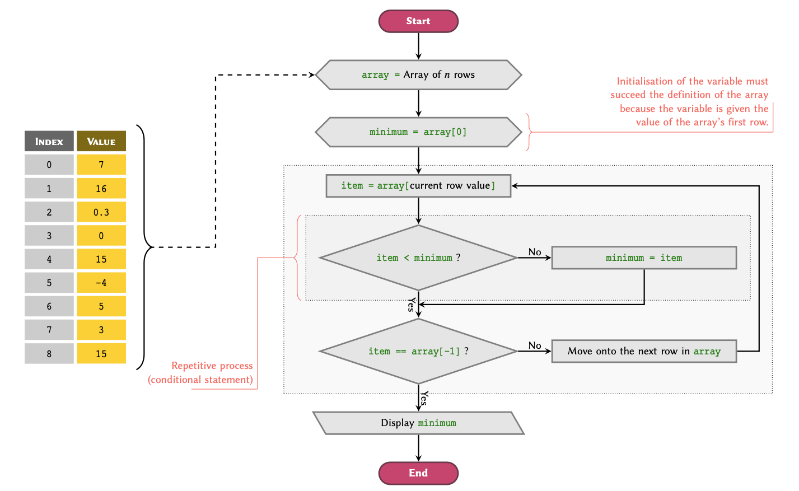
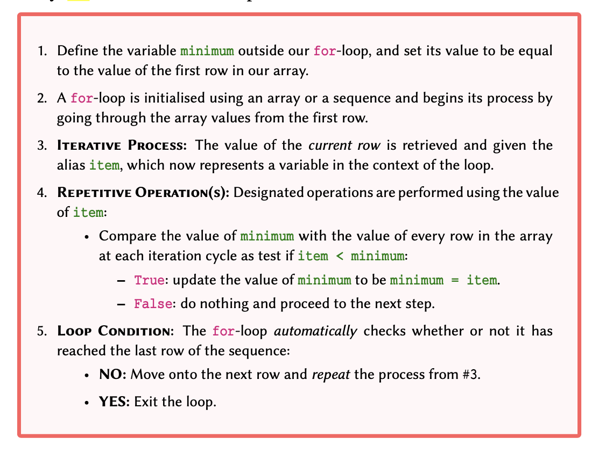
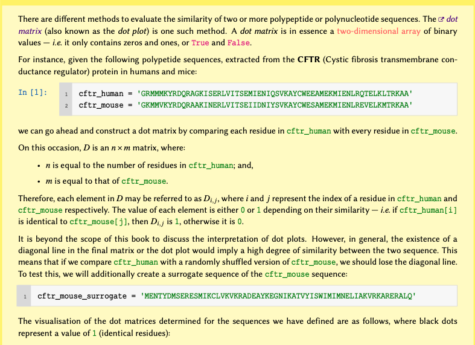
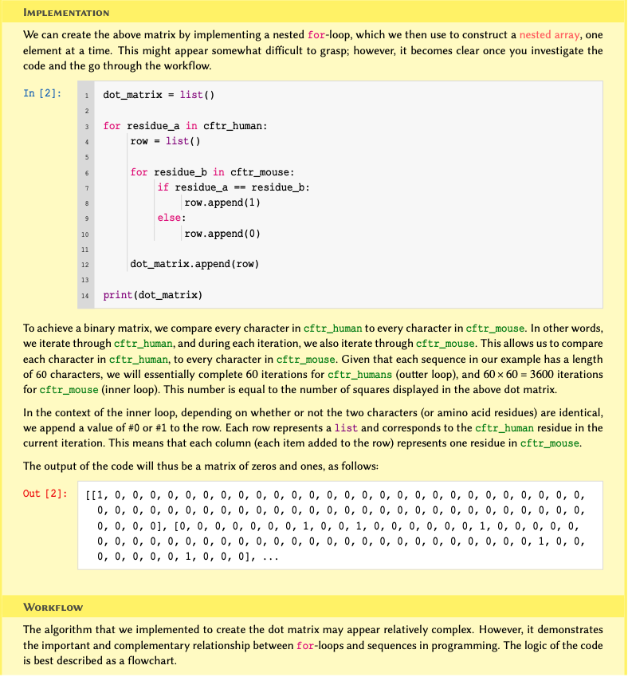
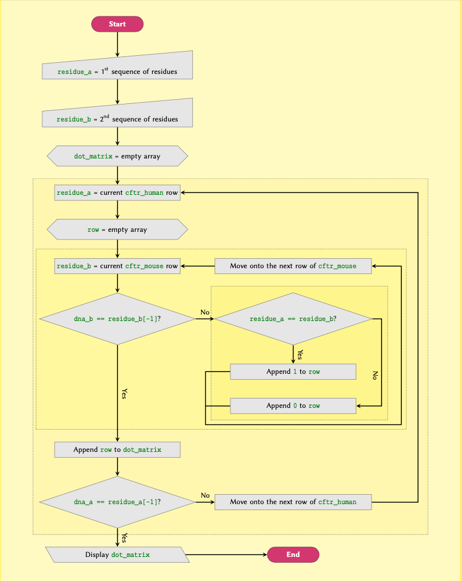
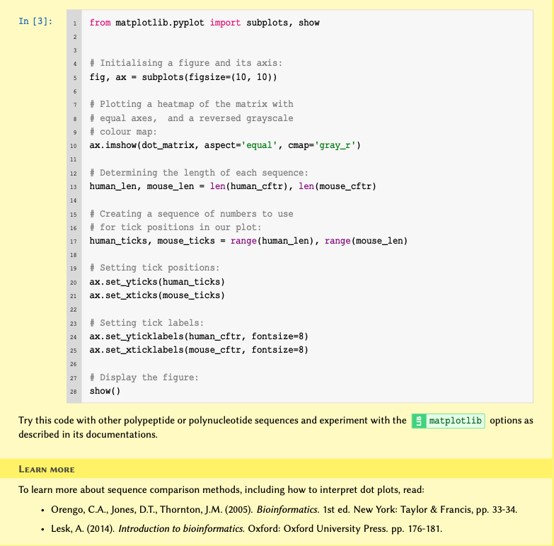
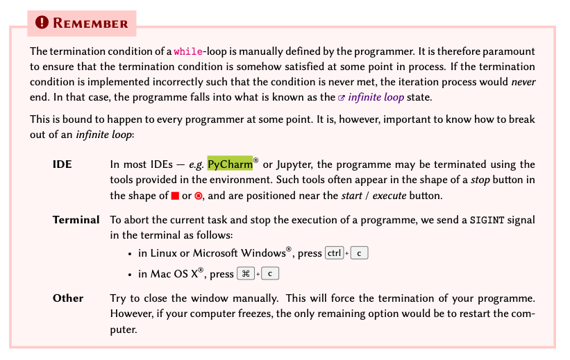
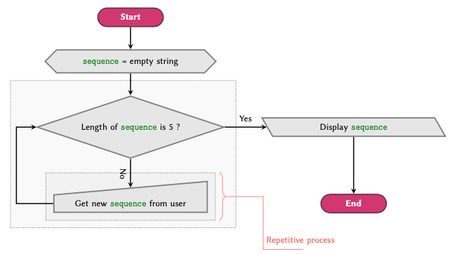

[**Download Chapter pdf**](05-iterations.md.pdf)

[**Download Chapter notebook (ipynb)**](05-iterations.ipynb)

[<span style="color: rgb(255, 0, 0);">**Mandatory Lesson Feedback Survey**</span>](https://docs.google.com/forms/d/e/1FAIpQLSdr0capF7jloJhPH3Pki1B3LZoKOG16poOpuVJ7SL2LkwLHQA/viewform?pli=1)


:::::::::::::::::::::::::::::::::::::: questions 

- What do we mean by *iterations* and *loops*?
- How are ```for```-loops implemented?
- Can conditional statements be used in iterations?
- When to use ```while```-loops?

::::::::::::::::::::::::::::::::::::::::::::::::


::::::::::::::::::::::::::::::::::::: objectives

- Understanding the concept of iterations and loops.
- Learning the processes involved in ```for```-loops implementation.
- Building concept of using conditional statements in loops.
- Understanding when to use while loop.

::::::::::::::::::::::::::::::::::::::::::::::::

<br>
<p align = "center">
<iframe width="560" height="315" src="https://www.youtube.com/embed/SNZFXRrxMjE" title="YouTube video player" frameborder="0" allow="accelerometer; autoplay; clipboard-write; encrypted-media; gyroscope; picture-in-picture" allowfullscreen></iframe>
</p>
<br>
<p align = "center">
<iframe width="560" height="315" src="https://www.youtube.com/embed/cNQ692g8NLw" title="YouTube video player" frameborder="0" allow="accelerometer; autoplay; clipboard-write; encrypted-media; gyroscope; picture-in-picture" allowfullscreen></iframe>
</p>
<br>
This chapter assumes that you are familiar with the following concepts in Python 3:

:::::::::::::::::: prereq
- [I/O Operations](02-input_output.Rmd#operations)
- [Variables and Types](02-input_output.Rmd#varTypes)
- [Mathematical Operation](02-input_output.Rmd#math_ops)
- [Logical Operations](02-input_output.Rmd#subsec:logicalOperatons)
- [Indentation Rule](03-conditional_statements.Rmd#subsubsec:indentationRule)
- [Conditional Statements](03-conditional_statements.Rmd)
- [Arrays](04-arrays.Rmd)

:::::::::::::::::: 

<p style='text-align: justify;'>
Additionally, make sure that you are comfortable with the principles of [indexing](04-arrays.Rmd#sec:list:indexing) in arrays before you start this section. It is very important that you have a good understanding of arrays and sequences, because the concept of iteration in programming deals *almost* exclusively with these subjects.
</p>

:::::::::::::::::::::::::::::::::::: callout
## Note	
<p style='text-align: justify;'>
You can practice everything in this section and the subsequent ones as you have been doing so far. However, if you find it hard to grasp some of the concepts, don't worry, you are not alone. It takes practice. To help you with that, [Philip Guo](http://www.pgbovine.net) from UC San Diego (Calif., USA) has developed [PythonTutor.com](http://www.pythontutor.com/visualize.html\#mode=edit), an excellent online tool for learning Python. On that website, write (or 'copy and paste') your code in the editor, then click *Visualize Execution*. In the new page, use the *forward* and *back* buttons to see a step-by-step graphical visualisation of the processes that occur during the execution of your code. Try it on the examples in this section.
</p>

:::::::::::::::::::::::::::::::::::: 


## The concept
<p style='text-align: justify;'>
We employ iterations and loops in programming to perform repetitive operations. A repetitive operation is a reference to one or several defined operations that are repeated multiple times. 
</p>

For instance, suppose we have a ```list``` of 5 numbers as follows:

```
numbers = [-3, -2, 5, 0, 12]
```

Now we would like to multiply each number by 2. Based on what we have learned thus far, this is how we would approach this problem:


```python
numbers = [-3, -2, 5, 0, 12]
	
numbers[0] *= 2
numbers[1] *= 2
numbers[2] *= 2
numbers[3] *= 2
numbers[4] *= 2
	
print(numbers)
```

```{.output}
[-6, -4, 10, 0, 24]
```

<p style='text-align: justify;'>
Whilst this does the job, it is clearly very tedious and repetitive. In addition to that, if we have an array of several thousand members, this approach becomes infeasible. 
</p>

The process of multiplying individual members of our array with 2 is a very simple example of a repetitive operations. 


:::::::::::::::::::::::::::::::::::: callout
## Remember	
In programming, there is a universally appreciated golden principle known as the **DRY** rule; and this is what it stand for: 

<p align = "center">
**D**on't **R**epeat **Y**ourself	
</p>

So if you find yourself doing something again and again, it is fair to assume that there might a better way of getting the results you're looking for ...
	
Some programmers (with questionable motives) have come up with a **WET** rule too. Find out more about DRY and WET from [Wikipedia](https://en.wikipedia.org/wiki/Don\%27t_repeat_yourself).

:::::::::::::::::::::::::::::::::::: 

<p style='text-align: justify;'>
There are some universal tools for iterations that exist in all programming languages --- *e.g.* <kbd>for</kbd> and <kbd>while</kbd> loops. Some other tools such as vectorisation or generators, however, are unique to one or several specific programming languages.
</p>

<p style='text-align: justify;'>
Throughout this section, we will discuss iterations via <kbd>for</kbd> and <kbd>while</kbd> loops, and review some real-world examples that may only be addressed using iterative processes. 
</p>

## for-loops {#for-loop}

<p style='text-align: justify;'>
Some of the data show that up to 80\% of all conventional iterations are implemented as <kbd>for</kbd> loops. Whether or not it is the best choice in of all these cases is a matter of opinion. What is important, however, is to learn the difference between the 2 methods and feel comfortable with how they work. 
</p>

<p style='text-align: justify;'>
Implementation of <kbd>for</kbd> loops in Python is simple compared to other programming languages. It essentially iterates through an existing *iterable* variable --- e.g.  an array, and retrieves the values from it one by one, from the beginning right down to the end.
</p>

:::::::::::::::::::::::::::::::::::: callout
## Remember	
<p style='text-align: justify;'>
In Python, *iterable* is a term used in reference to variables that can be iterated through. Any variable type that can be used in a <kbd>for</kbd> loop *without* any modifications is therefore considered an *iterable*.
</p>

<p style='text-align: justify;'>
Most arrays and sequences are iterable. See [Table](02-input_output.Rmd#fig:nativeTypes) to find out which native types in Python are iterable. A rule of thumb is that if an array or a sequence is numerically indexed (e.g.  ```list```, ```tuple```, or ```str```), it is an iterable.	
</p>

::::::::::::::::::::::::::::::::::::

{#flowchart}	


[Figure](#flowchart) illustrates a flowchart to visualise the workflow of an iterative process using <kbd>for</kbd> loops in Python. The process depicted in the flowchart may be described as follows:
	

:::::::::::::::::::::::::::::::::::: callout
## Advanced Topic	
<p style='text-align: justify;'>
An iterable is a Python variable that contains the built--in method ```.__iter__()```. Methods starting and ending with two underscores (dunderscores) are also known as *magic methods* in Python. See [Python documentations](https://docs.python.org/3/tutorial/classes.html\#iterators) for additional information.
</p>
	
:::::::::::::::::::::::::::::::::::: 

:::::::::::::::::::::::::::::::::::: discussion
## Process
1. A ```for```-loop is initialised using an array or a sequence and begins its process by going through the array values from the first row.
	
2. **Iterative Process:** The value of the *current row* is retrieved and given the alias <span style="color: rgb(32, 121, 77);">item</span>, which now represents a variable in the context of the loop.

3. **Repetitive Operation(s):** Designated operations are performed using the value of <span style="color: rgb(32, 121, 77);">item</span>:
 
    - <span style="color: rgb(32, 121, 77);">item *= 2</span>

4. **Loop Condition:** The <kbd>for</kbd> loop *automatically* checks whether or not it has reached the last row of the sequence:

    - **NO:** Move onto the next row and *repeat* the process from \#2.
    - **YES:** Exit the loop.

:::::::::::::::::::::::::::::::::::: 

We write this process in Python as:


```python
numbers = [3, 5, 6.3, 9, 15, 3.4]
	
for item in numbers:
    item *= 2
    # Display the item to see the results:
    print(item)
```

```{.output}
6
10
12.6
18
30
6.8
```

<p style='text-align: justify;'>
where we can see that the result for each iteration is displayed in a new line. [Example](#ExtExmp) outlines other such applications and expands on repetitive operations that may be simplified using <kbd>for</kbd> loops.
</p>

:::::::::::::::::::::::::::::::::::: callout
## Remember	
A <kbd>for</kbd> loop is always initialised as:
	
```
for variable_name in an_array: 
  # An indented block of processes 
  # we would like to perform on the
  # members of our array one by one.
```

<p style='text-align: justify;'>
where ```an_array``` is an *iterable* variable, and ```variable_name``` is the name of the variable we temporarily assign to a member of ```an_array``` that corresponds with the current loop cycle (iteration). The number of loop cycles performed by a <kbd>for</kbd> loop is equal to the length (number of members) of the array that we are iterating through, which in this case is called ```an_array```. 
</p>	

<p style='text-align: justify;'>
You can think of each iteration cycle as pulling out a row from table that is our array (as exemplified in section [arrays](04-arrays.Rmd)) and temporarily assigning its corresponding value to a variable until the next iteration cycle. 
</p>	

See subsection [List Members](04-arrays.Rmd#listMem) to find the length of an array.

:::::::::::::::::::::::::::::::::::: 

::::::::::::::::::::::::::::::: challenge 

## Do it Yourself

Given:


```python
peptides = [
    'GYSAR',
    'HILNEKRILQAID',
    'DNSYLY'
		]
```

Write a <kbd>for</kbd> loop to display each item in <span style="color: rgb(32, 121, 77);">peptides</span> alongside its index and length. Display the results in the following format:	

```Peptide XXXX at index X contains X amino acids.```
	
::::::::::::::::: solution
	
## DIY ANSWER

```python
for sequence in peptides:
    length = len(sequence)
    index = peptides.index(sequence)
		    
    print('Peptide', sequence, 'at index', index, 'contains', length, 'amino acids.')
```

```{.output}
Peptide GYSAR at index 0 contains 5 amino acids.
Peptide HILNEKRILQAID at index 1 contains 13 amino acids.
Peptide DNSYLY at index 2 contains 6 amino acids.
```

:::::::::::::::::

::::::::::::::::::::::::::::::: 

:::::::::::::::::::::::::::::::::::: discussion
 
### Extended example of iterations using ```for``` loops {#ExtExmp}
When using a <kbd>for</kbd> loop, we can also reference other variables that have already been defined outside of the loop block:
	

```python
numbers = [3, 5, 6.3, 9, 15, 3.4]
counter = 0
		
for item in numbers:
    item *= 2
		
    # Display the item to see the results:
    print('Iteration number', counter, ':', item)
		
    counter += 1
```

```{.output}
Iteration number 0 : 6
Iteration number 1 : 10
Iteration number 2 : 12.6
Iteration number 3 : 18
Iteration number 4 : 30
Iteration number 5 : 6.8
```
	
It is also possible to define new variables inside the loop, but remember that the value of any variables defined inside a loop is reset in each iteration cycle:
	

```python
numbers = [3, 5, 6.3, 9, 15, 3.4]
counter = 0 
		
for item in numbers:
    new_value = item * 2
	        
    # Display the item to see the results:
    print('Iteration number', counter, ':', item, '* 2 =', new_value)
            
    counter += 1
```

```{.output}
Iteration number 0 : 3 * 2 = 6
Iteration number 1 : 5 * 2 = 10
Iteration number 2 : 6.3 * 2 = 12.6
Iteration number 3 : 9 * 2 = 18
Iteration number 4 : 15 * 2 = 30
Iteration number 5 : 3.4 * 2 = 6.8
```

:::::::::::::::::::::::::::::::::::: 
::::::::::::::::::::::::::::::: challenge 

## Do it Yourself

Write a ```for``` loop to display the values of a ```tuple``` defined as:

```python
protein_kinases = ('PKA', 'PKC', 'MPAK', 'GSK3', 'CK1')
```

such that each protein is displayed on a new line and follows the phrase ```Protein Kinase X:``` as in
	
```
Protein Kinase 1: PKA
Protein Kinase 2: PKC
```
	
and so on. 	

::::::::::::::::: solution
## DIY ANSWER


```python
counter = 1
		
for protein in protein_kinases:
    print('Protein Kinase ', counter, ': ', protein, sep='')
    counter += 1
```

```{.output}
Protein Kinase 1: PKA
Protein Kinase 2: PKC
Protein Kinase 3: MPAK
Protein Kinase 4: GSK3
Protein Kinase 5: CK1
```

:::::::::::::::::

::::::::::::::::::::::::::::::: 	

### **Retaining the new values**
<p style='text-align: justify;'>
It is nice to be able to manipulate and display the values of an array but in the majority of cases, we need to retain the new values and use them later.
</p>

In such cases, we have two options:

  - Create a new array to store our values.
  - Replace the existing values with the new ones by overwriting them in the same array.

<p style='text-align: justify;'>
Creating a new array to store our values is very easy. All we need to do is to create a new ```list``` and add values to it in every iteration. In other words, We start off by creating an empty ```list```; to which we then add members using the <kbd>.append()</kbd> method inside our <kbd>for</kbd> loop. The process of creating a new ```list``` and using the <kbd>.append()</kbd> method to values to an existing ```list``` are discussed in subsections [Useful Methods](04-arrays.Rmd#subsubsec:list:usefulMethodsForList) and [mutability](04-arrays.Rmd#subsubsec:list:mutability), respectively.
</p>


```python
numbers = [-4, 0, 0.3, 5]
new_numbers = list()
	
for value in numbers:
    squared = value ** 2
    new_numbers.append(squared)
	
print('numbers:', numbers)
```

```{.output}
numbers: [-4, 0, 0.3, 5]
```

```python
print('new_numbers:', new_numbers)
```

```{.output}
new_numbers: [16, 0, 0.09, 25]
```


::::::::::::::::::::::::::::::: challenge 

## Do it Yourself

Given:


```python
peptides = [
    'GYSAR',
    'HILNEKRILQAID',
    'DNSYLY'
		]
```
write a ```for``` loop in which you determine the length of each sequence in <span style="color: rgb(32, 121, 77);">peptides</span>, and then store the results as a ```list``` of ```tuple``` items as follows:

```
[('SEQUENCE_1', X), ('SEQUENCE_2', X), ...]
```
	
::::::::::::::::: solution
	
## DIY ANSWER


```python
peptides_with_length = list()
		
for sequence in peptides:
    length = len(sequence)
    item = (sequence, length)
		    
    peptides_with_length.append(item)
```

:::::::::::::::::

::::::::::::::::::::::::::::::: 

The replacement method uses a slightly different approach. Essentially what we try to achieve is:


  - read the value of an item in an array;
  - manipulate the value via operations;
  - put the value back to the original array through *item assignment* and thereby replace the existing value. 

<p style='text-align: justify;'>
We learned about modifying an existing value in a ```list``` in subsection [mutability](04-arrays.Rmd#subsubsec:list:mutability), where we discussed the concept of *item assignment*. The process of replacing the original values of an array in a <kbd>for</kbd> loop is identical. The key to performing this process, however, is that we need to have the correct *index* for the specific member of the array that we are trying to modify. Additionally, don't forget that *item assignment* is only possible in mutable arrays such as ```list```. See [Table](02-input_output.Rmd#fig:nativeTypes) to see which types of array are mutable in Python. 
</p>

<p style='text-align: justify;'>
To perform *item assignment*; we can implement a variable to represent the current iteration cycle in our <kbd>for</kbd> loop. We do so by initialising the variable with a value of 0, and adding 1 to its value at the end of each cycle. We can then use that variable as an *index* in each iteration cycle:
</p>


```python
numbers = [-4, 0, 0.5, 5]
	
# Variable representing the 
# index (iteration cycle):
index = 0
	
for value in numbers:
    new_value = value ** 5
	    
    # Putting it back into 
    # the original array:
    numbers[index] = new_value
	    
    # Adding one to the index for 
    # the next iteration cycle:
    index += 1
	
print(numbers)
```

```{.output}
[-1024, 0, 0.03125, 3125]
```

:::::::::::::::::::::::::::::::::::: callout
## Advanced Topic
<p style='text-align: justify;'>
The ```enumerate()``` function actually returns a *generator* of ```tuple``` items each time it is called in the context of a ```for``` loop. A generator is in principle very similar to a normal array; however, unlike an array, the values of a generator are not evaluated by the computer until the exact time at which they are going to be used. This is an important technique in functional programming known as *lazy evaluation*. It is primarily utilised to reduce the workload on the computer (both the processor and the memory) by preventing the execution of processes that may be delayed for a later time. In the case of the ```enumerate()``` function, the values are evaluated at the beginning of each iteration cycle in a ```for``` loop. Learn more about lazy evaluation in [Wikipedia](https://en.wikipedia.org/wiki/Lazy_evaluation) or read more on generators in Python in the [official documentations](https://docs.python.org/3/howto/functional.html\#generators).
</p>	

:::::::::::::::::::::::::::::::::::: 

<p style='text-align: justify;'>
This is a perfectly valid approach and it is used in many programming languages. However, Python makes this process even easier by introducing the function <kbd>enumerate()</kbd>. We often use this function at the initiation of a <kbd>for</kbd> loop. The function takes an array as an input and as the name suggests, enumerates them; thereby simplifying the indexing process. The previous example may therefore be written more concisely in Python as follows:
</p>


```python
numbers = [-4, 0, 0.5, 5]
	
for index, value in enumerate(numbers):
    # Manipulating the value:
    new_value = value ** 5
    numbers[index] = new_value
	
print(numbers)
```

```{.output}
[-1024, 0, 0.03125, 3125]
```

::::::::::::::::::::::::::::::: challenge 

## Do it Yourself {#diy:loops:for:enumerate}

Given:

```python
characters = ['1', '2', '3', '4']
```
Display each item in <span style="color: rgb(32, 121, 77);">characters</span> as many times in one line as the index of that item in <span style="color: rgb(32, 121, 77);">characters</span>. The results should appear as follows:	

```
2
33
444
```
::::::::::::::::: solution
	
## DIY ANSWER

```python
for index, item in enumerate(characters):
    print(item * index)
```

```{.output}

2
33
444
```

:::::::::::::::::

:::::::::::::::::::::::::::::::

### **for-loop and conditional statements** {#subsubsec:loops:for:conditionalStatements}
We can use conditional statements within <kbd>for</kbd> loops to account for and handle different situations.

Suppose we want to find the smallest value (the minimum) within a ```list``` of numbers using a <kbd>for</kbd> loop. The workflow of this process is displayed as a flowchart diagram in [figure below](#flowchart5-2-2).

{#flowchart5-2-2}

Given an array, we can break down the problem as follows:




Finally, we can implement the process displayed in [figure](#flowchart5-2-2) as follows:


```python
numbers = [7, 16, 0.3, 0, 15, -4, 5, 3, 15]
	
minimum = numbers[0]
	
for value in numbers:
    if value < minimum:
        minimum = value 
	
print('The minimum value is:', minimum)
```

```{.output}
The minimum value is: -4
```

::::::::::::::::::::::::::::::: challenge 

## Do it Yourself
Given:

```python
peptides = [
  'FAEKE',
  'CDYSK',
  'ATAMGNAPAKKDT',
  'YSFQW',
  'KRFGNLR',
  'EKKVEAPF',
  'GMGSFGRVML',
  'YSFQMGSFGRW',
  'YSFQMGSFGRW'
		]
```
Using a ```for``` loop and a conditional statement, find and display the sequences in <span style="color: rgb(32, 121, 77);">peptides</span> that contain the amino acid serine (<span style="color: rgb(32, 121, 77);">S</span>) in the following format:	

```
Found S in XXXXX.
```	
::::::::::::::::: solution
	
## DIY ANSWER


```python
target = 'S'
		
for sequence in peptides:
    if target in sequence:
        print('Found', target, 'in', sequence)
```

```{.output}
Found S in CDYSK
Found S in YSFQW
Found S in GMGSFGRVML
Found S in YSFQMGSFGRW
Found S in YSFQMGSFGRW
```
:::::::::::::::::

::::::::::::::::::::::::::::::: 

### **Sequence of numbers in for-loops** {#subsec:iter:for:range}
<p style='text-align: justify;'>
To produce a sequence of ```int``` numbers to use in a <kbd>for</kbd> loop, we can use the built-in <kbd>range()</kbd> function. The function takes in 3 positional arguments representing *start*, *stop*, and *step*. Note that <kbd>range()</kbd> is *only* capable of producing a sequence of integer numbers.
</p>

:::::::::::::::::::::::::::::::::::: callout
## Remember	
The <kbd>range()</kbd> function does not create the sequence of numbers immediately. Rather, it behaves in a similar way as the <kbd>enumerate()</kbd> function does (as a generator).
	
:::::::::::::::::::::::::::::::::::: 

Displaying the output of a <kbd>range()</kbd> function is not, as one might expect, an array of numbers:


```python
range_generator = range(0, 10, 2)
	
print(range_generator)
```

```{.output}
range(0, 10, 2)
```


It is, however, possible to evaluate the values outside of a <kbd>for</kbd> loop. To do so, we need to convert the output of the function to ```list``` or a ```tuple```:


```python
range_sequence = list(range_generator)
	
print(range_sequence)
```

```{.output}
[0, 2, 4, 6, 8]
```

:::::::::::::::::::::::::::::::::::: callout
## Remember	
<p style='text-align: justify;'>
The <kbd>range()</kbd> function is *non-inclusive*. That is, it creates a sequence that starts from and includes the value given as the *start* argument, up to but excluding the the value of the *end* argument. For instance, ```range```(1, 5, 1) creates a sequence starting from <span style="color: rgb(32, 121, 77);">1</span>, which is then incremented <span style="color: rgb(32, 121, 77);">1</span> step at a time right up to <span style="color: rgb(32, 121, 77);">5</span>, resulting in a sequence that includes the following numbers: <span style="color: rgb(32, 121, 77);">1, 2, 3, 4</span>
</p>

:::::::::::::::::::::::::::::::::::: 

:::::::::::::::::::::::::::::::::::: discussion

## Example: Sequence comparison. dot plots and ```for```-loops{#bigexam}
{#example}
{#dot}
{#dotImp}




::::::::::::::::::::::::::::::::::::

## while-loops

<p style='text-align: justify;'>
In the previous, we explored ```for```-loop mediated iterations and learned that they are *exclusively* applied to iterable objects --- e.g.  arrays and sequences. This is because, as demonstrated in [workflow figure](#flowchart), at the end of each iteration, the *implicit* termination condition that is inherent in the process tests whether or not it has reached the end of the sequence it is iterating through. 
</p>

<p style='text-align: justify;'>
It may, however, be deemed necessary to apply iterative processes based on conditions other than that embedded in the ```for```-loop. In such cases, we use a different class of iterations known as the ```while```-loop. 
</p>




Consider the following scenario:

>We want to ask the user to enter a sequence of exactly 5 amino acids in single letter code. If the provided sequence is more or less than 5 letters long, we would like to display a message and ask them to try again; otherwise, we will display the process and terminate the programme.


<p style='text-align: justify;'>
It is impossible to write such a process using a ```for```-loop. This is because when we initialise the iteration process, the number of loops we need is unknown. In other words, we simply do not know how many times the user would need enter said sequence before they get it right.
</p>

{#flowchart3}

<p style='text-align: justify;'>
To simplify the understanding of the concept, we can visualise the process in flowchart, as displayed in [figure](#flowchart3). In the flowchart, you can see that the only way to exit the loop is to enter a sequence of exactly 5 characters. Doing anything else --- i.e. entering a different number of letters -- is tantamount to going back to be beginning of the loop. The process may be described verbally as follows:
</p>

1.  Initialise the variable <span style="color: rgb(32, 121, 77);">sequence</span> and assign an empty string to it.

2. *While* the length of <span style="color: rgb(32, 121, 77);">sequence</span> is not equal to 5: 

   - Ask the use to enter a new <span style="color: rgb(32, 121, 77);">sequence</span>.
   - Go back to <span style="color: rgb(32, 121, 77);">\#2</span>.

3. Display the value of <span style="color: rgb(32, 121, 77);">sequence</span>.


### **Implementation**
We start ```while```-loop using the <kbd>while</kbd> syntax, immediately followed by the loop condition. 

We can now implement the process displayed in [figure](#flowchart3) as follows:

```
sequence = str()
	
while len(sequence) != 5:
    sequence = input('Enter a sequence of exactly 5 amino acids: ')
	
print(sequence)
```

When executed, the above code will prompt the user to enter a value:

```
Enter a sequence of exactly 5 amino acids: GCGLLY
Enter a sequence of exactly 5 amino acids: GCGL
Enter a sequence of exactly 5 amino acids: GC
Enter a sequence of exactly 5 amino acids: GCGLL

GCGLL
```

As expected, the user is repetitively asked to enter a 5 character sequence until they supply the correct number of letters.


::::::::::::::::::::::::::::::: challenge 
## Do it Yourself

1. Write a script which asks the user to enter a number, then: 

   - if the second power of the number is smaller than <span style="color: rgb(32, 121, 77);">10</span>, repeat the process and ask again;
   - if the second power of the number is equal or greater than <span style="color: rgb(32, 121, 77);">10</span>, display the original value and terminate the programme.

**Hint:** Don't forget to [convert](#sec:conversionType) the value enter by the user to an appropriate numeric type *before* you perform any mathematical operations. 
<p style='text-align: justify;'>	
2. We learned in subsection [Sequence of Numbers](#subsec:iter:for:range) that the built-in function <kbd>range()</kbd> may be utilised to produce a sequence of *integer* numbers. The function takes 3 input arguments in the following order: <span style="color: rgb(32, 121, 77);">stop, start, step</span>.
</p>

We now need a sequence of floating point numbers with the following criteria:
		
``` 
stop = 10
start = 0
step = 0.5
``` 
<p style='text-align: justify;'>
The use of a floating point number as <span style="color: rgb(32, 121, 77);">step</span> means that we cannot use <kbd>range()</kbd> to create the desired sequence. Write a script in which you use a ```while```-loop to produce a sequence of floating point numbers with the above criteria and display the result.
</p>		
The resulting sequence must be:

   - presented as an instance of type ```list```;
   - similar to <kbd>range()</kbd>, the sequence must be non-inclusive --- *i.e.* it must include the value of <span style="color: rgb(32, 121, 77);">start</span>, but not that of <span style="color: rgb(32, 121, 77);">stop</span>.	
   
::::::::::::::::: solution
	
## Q1

```
value = 0
		
while value ** 2 < 10:
    response = input('Enter a number: ')
    value = float(response)
		
print(value)
```
:::::::::::::::::

::::::::::::::::: solution
	
## Q2

```python
stop = 10
start = 0
step = 0.5
		
number = start
sequence = list()
		
while number < stop:
    sequence.append(number)
    number += step
		
print(sequence)
```

```{.output}
[0, 0.5, 1.0, 1.5, 2.0, 2.5, 3.0, 3.5, 4.0, 4.5, 5.0, 5.5, 6.0, 6.5, 7.0, 7.5, 8.0, 8.5, 9.0, 9.5]
```

:::::::::::::::::

::::::::::::::::: solution
	
## Q2 - Smart Solution

```python
# A smarter solution, however, would be:
stop = 10
start = 0
step = 0.5
		
sequence = [start]
		
while sequence[-1] < stop:
    sequence.append(sequence[-1] + step)
		
print(sequence)
```

```{.output}
[0, 0.5, 1.0, 1.5, 2.0, 2.5, 3.0, 3.5, 4.0, 4.5, 5.0, 5.5, 6.0, 6.5, 7.0, 7.5, 8.0, 8.5, 9.0, 9.5, 10.0]
```

:::::::::::::::::
::::::::::::::::::::::::::::::: 

### **Breaking a while-loop**

Unlike ```for```-loops, it is common to *break* out of a ```while```-loop mid-process. This is also known as *premature termination*. 

To consider a situation that may necessitate such an approach, we shall modify our scenario as follows:

<p style='text-align: justify;'>
>We want to ask the user to enter a sequence of exactly 5 amino acids. If the sequence the user provides is more or less than 5 letters long, we would like to display a message and ask them to try again; otherwise, we will display the sequence and terminate the programme. Additionally, the loop should be terminated:
   - upon 3 failed attempts; or,
   - if the user entered the word <span style="color: rgb(32, 121, 77);">exit</span> instead of a 5 character sequence. 

</p>
In the former case, however, we would also like to display a message and inform the user that we are terminating the programme because of 3 failed attempts.

To implement the first addition to our code, we will have to make the following alterations in our code:

   - Define a variable to hold the iteration cycle, then test its value at the beginning of each cycle to make sure that it is below the designated threshold. Otherwise, we manually terminate the loop using the <kbd>break</kbd> syntax. 

   - Create a [conjunctive](#disjun) conditional statement for the ```while```-loop to make so that it is also sensitive to our <span style="color: rgb(32, 121, 77);">exit</span> keyword.


```
sequence = str()
counter = 1
max_counter = 3
exit_keyword = 'exit'
	
while len(sequence) != 5 and sequence != exit_keyword:
    if counter == max_counter:
        sequence = "Three failed attempt - I'm done."
        break
	    
    sequence = input('Enter a sequence of exactly 5 amino acids or [exit]: ')
	    
    counter += 1
	
print(sequence)
```

## Exercises
:::::::::::::::::::::::::::::::::::::::: challenge

### End of chapter Exercises

1. Can you explain the reason why in the example given in subsection [for-loop and conditional statements](#subsubsec:loops:for:conditionalStatements) we set <span style="color: rgb(32, 121, 77);">minimum</span> to be equal to the first value of our array instead of, for instance zero or some other number?
		
Store your answer in a variable and display it using <kbd>print()</kbd>.
		
2. Write a script that using a <kbd>for</kbd> loop, calculates the sum of all numbers in an array defined as follows:
		
```
numbers = [0, -2.1, 1.5, 3]
``` 
		
and display the result as:

```
Sum of the numbers in the array is 2.4
```
3. Given an array of integer values as:
		
```
numbers = [2, 1, 3]
``` 
 
write a script that using <kbd>for</kbd> loops, displays each number in the list as many time as the number itself. The programme must therefore display 2 twice, 1 once, and 3 three times.
		
4.  Given a ```list``` of numbers defined as:

```
numbers = [7, 16, 0.3, 0, 15, -4, 5, 3, 15]
```
		
write a script that using at most two <kbd>for</kbd> loops, finds the *variance* of the numbers, and display the **mean**, and the **variance**. Note that you will need to calculate the *mean* as a part of your calculations to find the *variance*.
		
The equation for calculating the variance is: 

$$\sigma^2 = \frac{\sum^{n}_{i=1}(x_i - \mu)^2}{n}$$ 
		
**Hint:** Breaking down the problem into smaller pieces will simplify the process of translating it into code and thereby solving it:
		
(a) Work out the Mean or $\mu$ (the simple average of the numbers): 
$$ \mu = \frac{\sum^{n}_{i=1} x_i}{n}$$ 
(b) Calculate the sum of: each number ($x_i$) subtracted by the Mean ($\mu$) and square the result.

(c) Divide the resulting number by the length of <span style="color: rgb(32, 121, 77);">number</span>.

		
Display the results in the following format:

```
Mean: XXXX
Variance: XXXX
```
	
::::::::::::::::::::: solution

## Please check these solutions only after submitting the assignments.

### Q1


```python
answer = "Because the minimum of the array may be smaller than zero."

print(answer)
```

```{.output}
Because the minimum of the array may be smaller than zero.
```


### Q2


```python
numbers = [0, -2.1, 1.5, 3]

numbers_sum = 0

for value in numbers:
    numbers_sum += value
    
print("Sum of the numbers in the array is", numbers_sum)
```

```{.output}
Sum of the numbers in the array is 2.4
```


### Q3


```python
numbers = [2, 1, 3]

for value in numbers:
    prepped_value = [value] * value
    
    for number in prepped_value:
        print(number)
```

```{.output}
2
2
1
3
3
3
```

### Q4


```python
numbers = [7, 16, 0.3, 0, 15, -4, 5, 3, 15]

numbers_length = len(numbers)

# Calculating the "sum"
# ---------------------------------------------------------
numbers_sum = 0

for value in numbers:
    numbers_sum += value
    
    
# Calculating the "mean"
# ---------------------------------------------------------

numbers_mean = numbers_sum / numbers_length


# Calculating the "variance"
# ---------------------------------------------------------

variance_denominator = numbers_length
variance_numerator = 0

for value in numbers:
    prepped_value = (value - numbers_mean) ** 2
    variance_numerator += prepped_value
    
numbers_variance = variance_numerator / variance_denominator


# Results
# ---------------------------------------------------------

print("Mean:", numbers_mean)
```

```{.output}
Mean: 6.366666666666666
```

```python
print("Variance:", numbers_variance)
```

```{.output}
Variance: 48.919999999999995
```
::::::::::::::::::::: 		 
::::::::::::::::::::::::::::::::::::::::


::::::::::::::::::::::::::::::::::::: keypoints 

- Iterations and loops are used to perform repetitive operations.
- Implementation of ```for```-loop involves 4 steps.
- Conditional statements are used within loops to handle different situations.
- ```while```-loop is suited when exact number of conditions/iterations are unknown.

::::::::::::::::::::::::::::::::::::::::::::::::


[r-markdown]: https://rmarkdown.rstudio.com/
