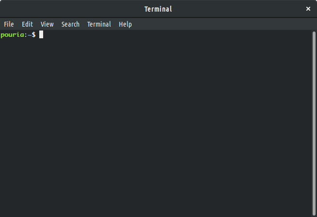
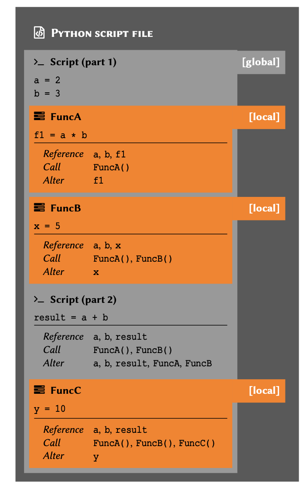
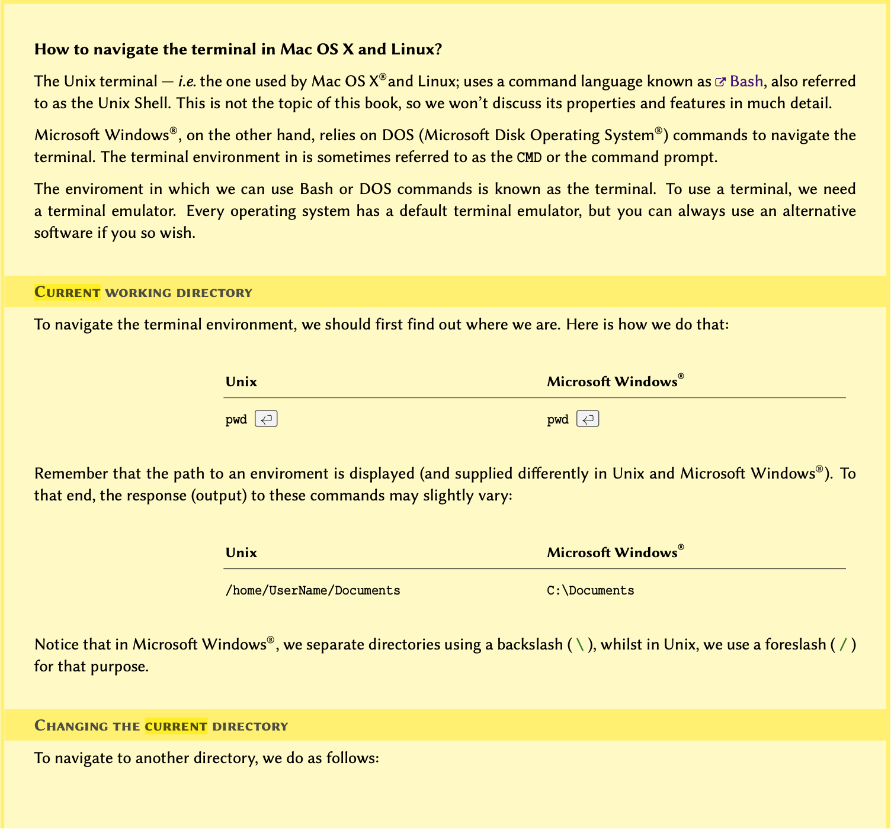
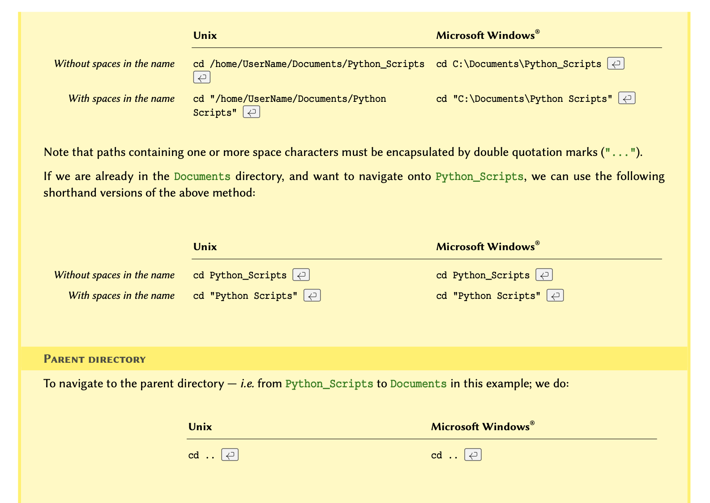
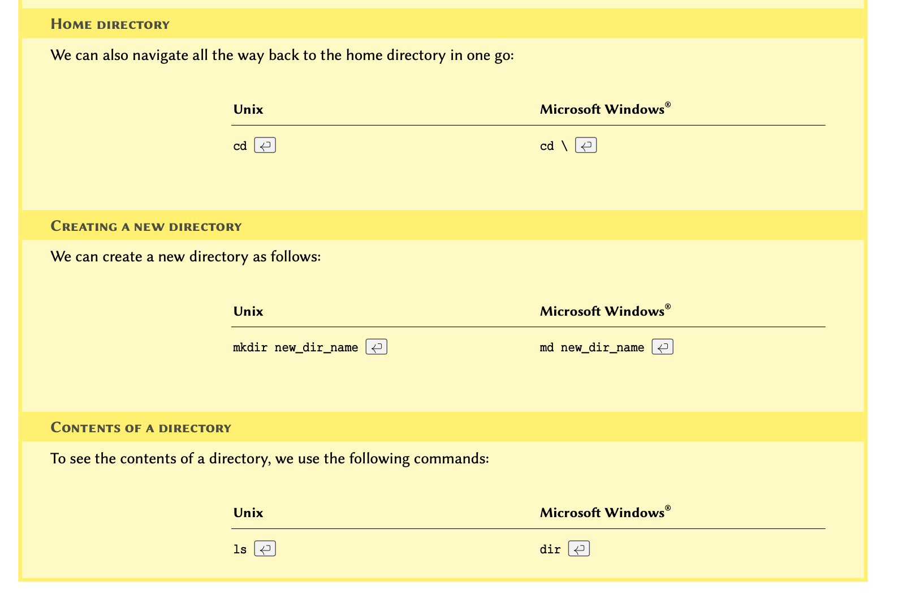

::::::::::::::::::::::::::::::::::::: questions 

- 
-
-

::::::::::::::::::::::::::::::::::::::::::::::::

::::::::::::::::::::::::::::::::::::: objectives

-
-
-
::::::::::::::::::::::::::::::::::::::::::::::::

<p style='text-align: justify;'> 
In programming, we process data and produce outputs. When the data is being processed, it is stored in the memory, so that it is readily available, and can therefore be subject to the processes we want to apply.
</p>

<p style='text-align: justify;'> 
Throughout this section, we will discuss how to handle data in Python. We start by learning how to display data on the screen, and receive an input from a user. We then use these techniques to perform different mathematical, and logical operations. This chapter introduces the fundamental principles that we will employ every time we code in Python. On that account, it is very important that you understand this chapter well before moving on. 
</p>


## I/O Operations {#operations}
<p style='text-align: justify;'> 
In computer science, input or output operations refer to the communication between an information processing system such as a computer, and the outside world, which may be a user or another computer. Such communications are more commonly known as *I/O operations*. In general, the outside world --- especially in the context of this course, may be loosely defined as anything that falls outside of the environment that is directly controlled by an application. 
</p>

::::::::::::::::::::::::::::::::::::: callout
## REMEMBER
<p style='text-align: justify;'>
Only what we define within the environment of our application and store in the memory is directly controlled by our application. We may access or take control over other environments through certain mediums; however, such interactions are classified as I/O operations. An example of this is interacting with a file on our computer, which we discuss in the topic of [Strings](REF-chapter:StringsAndFiles). Whilst we have complete control over the file while we are working on it (e.g.\ reading from it or writing to it), our access to the file and the transmission of data is in fact controlled and managed by the operating system.
</p>

::::::::::::::::::::::::::::::::::::: 


In programming, I/O operations include, but are certainly not limited to:

* displaying the results of a calculation to the user

* asking the user enter a value

* writing or reading data to and from a file or a database

* downloading data from the Internet

* operating a hardware (e.g.\ a robot)

* any operation that allows our programme to communicate the data stored in the memory.

:::::: prereq

## Advanced Topic
<p style='text-align: justify;'>
If you are interested in learning more about I/O systems and how they are handled at operating system level, you might benefit from chapter 13 of [*Operating Systems Concepts, 8^th^ ed.*](http://web.cse.ohio-state.edu/~soundarajan.1/courses/3430/silberschatz8thedition.pdf) by Abraham Silberschatz, Greg Gagne, and Peter Galvin.
</p>

:::::: 

### I/O Operations in Python
[**Input and Output**](https://docs.python.org/3/tutorial/inputoutput.html)

<p style='text-align: justify;'>
In this section, we learn about two very basic but most fundamental methods of I/O operations in Python. We will be using these methods throughout the course, so it is essential that you feel comfortable with them and the way they work before moving on. We shall return to I/O operations later in the course, especially in chapter [Strings](REF-chapter:StringsAndFiles).
</p>

:::::::::::::::::::::::::::::::::::::::::::::::: discussion	
### Producing an output
[**Print**](https://docs.python.org/3/library/functions.html\#print)

<p style='text-align: justify;'>
The term ```output``` in reference to an application typically refers to the data that has either been generated, or manipulated by that application.
</p>

<p style='text-align: justify;'>
For example; we have two number and we would like to calculate their sum. The action of calculating the sum is itself a [*mathematical operation*](REFmathematicalOperations) (discussed in the coming section). The result of our calculation is called an ```output```. Once we obtain the result, we might want to save it in a file or display it on the screen, in which case we will be performing an *I/O operation*.
</p>

<p style='text-align: justify;'>
The simplest and most frequently used method for generating an output in almost every modern programming language is to display something on the screen. We normally run our Python scripts and programmes from the terminal; so the typical (and the easiest) method for producing an output is to display it in the terminal.  The way we do this is by calling a dedicated built-in function called **```print()```**.
</p>

::::::::::::::::::::::::::::::::::::: callout

## REMEMBER

<p style='text-align: justify;'>
In programming, a ```function``` is essentially an isolated piece of code. It usually to takes some inputs, *does *something to or with them, and produces an ```output```. The pair of parenthesis that follow a function are there so that we can provide the function with the *input arguments* it needs when we *call* it, so that it can do what it is supposed to do using our data. We will explore functions in more details in chapter [Functions](REFchapterch:functions).
</p>

::::::::::::::::::::::::::::::::::::: 

The **```print()```** function can take several inputs and performs different tasks. Its primary objective, however, is to take some values as input and display them in the terminal. Here is how it works:

Suppose we want to display some text in the terminal. To do so, we write:

```
print('Hello world!')
```

in our favourite editor or IDE and save it as ```script_a.py``` in a file. This is not a fully functioning python programme that we can run using the Python interpreter.

If you are using an Integrated Development Environment (IDE) --- e.g.\ Visual Studio Code, you may execute your code using the internal tools provided by that IDE. The specifics of how you do so depends on the IDE that you are using.


Alternatively, we could always execute Python scripts manually. To do so, we open the terminal or the command prompt (CMD) in Windows and navigate to the directory where we saved ```script_a.py```. 

:::::: prereq

## NOTE
If you don't know how to navigate in the terminal, see the example in section [How to use terminal environment?] at the end of this chapter.

:::::: 

Once in the correct directory, we run the script by typing ```python3 script_a.py``` in our terminal as follows:

```{bash}
python3 script_a.py
```

This will call the Python 3 interpreter to execute the code we wrote in ```script_a.py```. Once executed, which in this case should be instantaneously, we should see the output:


**Congratulations** you have now successfully written and executed your first programme in Python.
:::::::::::::::::::::::::::::::::::::::::::::::: 	

::::::::::::::::::::::::::::::::::::: callout
## REMEMBER

<p style='text-align: justify;'>
We know **```print()```** is a *function* because it ends with a pair of parenthesis, and it is written entirely in lowercase characters [PEP-8: Function Names](https://www.python.org/dev/peps/pep-0008/#function-names). Some IDEs change color when they encounter built-in functions in the code so that we won't accidentally overwrite them. We shall discuss *functions* in more details in chapter [Functions](REFchapterch:functions).
</p>

::::::::::::::::::::::::::::::::::::: 

We can pass more than a single value to the **```print()```** function, provided that they are separated with a comma. For instance, if we write the code below and run the script, the results would be as shown in *output*.

```{python}
print('Hello', 'John')
```


Notice that there is a space between *Hello* and *John* even though we did not include a space in our text. This is the default behaviour of the **```print()```** function when it receives more than a single value (argument).

This default behaviour may be inhibited:

```{python}
print('Hello', 'John', sep='')

```

```{python}
print('Hello', 'John', sep='--')
```

```{python}
print('Jane', 21, 'London', sep='.')
```


::::::::::::::::::::::::::::::: challenge 

## Do it Yourself

Write a script that displays the following output:

>**Protein Kinase C (Alpha subunit)**
	
	
::::::::::::::::: solution
	
## DIY ANSWER

```{python}
print('Protein Kinase C (Alpha subunit)')
```

:::::::::::::::::

::::::::::::::::::::::::::::::: 

 

 {#fig:terMac}

:::::::::::::::::::::::::::::::::::::::::::::::: discussion	
### Receiving an input
[**Input**](https://docs.python.org/3/library/functions.html\#input)

Inputs are I/O operations that involve receiving some data from the outside world. This might include reading the contents of a file, downloading something the Internet, or asking the user to enter a value.

The simplest way to acquire an input is to ask the user to enter a value in the terminal. To do so, we use a dedicated built-in function called **```input()```**. 

::::::::::::::::::::::: callout
## Note 
In a Unix system (Mac OS or Linux), a tilde is an alias for a user's home directory.
::::::::::::::::::::::: 


The function takes a single *argument* called ```prompt```. Prompt is the text displayed in the terminal to ask the user for an input. Figure [\@ref(fig:terLinux)] REF(fig:prompt), illustrates a screen shot of my personal computer's prompt, where it displays my user name (i.e. ```pouria```) followed by a tilde (~). A terminal prompt may be different in each computer and operating system.


Here is how we implement the **input()** function:

> ```input('Please enter your name: ')```

which is exactly the same as:

> ```input(prompt='Please enter your name: ')```

If we save one of the above in a file and call it ```script_b.py```; and execute the file using the Python 3 interpreter as described previously, we shall see the following:

```
python3 script_b.py

Please enter your name: _
```

The terminal cursor, displayed as an underscore in our example, will be in front of the prompt (i.e. ```Please enter your name: ```) waiting for a response. Once it receives a response, it will proceed to run the rest of the code (if any), or terminate the execution.


We may store the user's response in a variable. Variables are the topic of the next section, where we shall also review more examples on **input()** and how we can use it to produce results based on the responses we receive from the user.

::::::::::::::::::::::::::::::::::::::::::::::::


::::::::::::::::::::::::::::::: callout

## Remember
Python is an interpreted language; that is, the code we write is executed by the Python interpreter one line at a time. The **input()** function performs a *blocking* process. This means that the execution of the code by the Python interpreter is halted upon encountering an **input()** function until the user enters a value. Once a value is entered, the interpreter then proceeds to execute the next line.

:::::::::::::::::::::::::::::::

::::::::::::::::::::::::::::::: challenge 
## Do it Yourself 
	
Write a script that asks the user to enter the name of a protein in the terminal.

::::::::::::::::::: solution 
## DIY ANSWER

> ```input('Please enter the name of a protein: ')```

:::::::::::::::::::
:::::::::::::::::::::::::::::::

## Variables And Types


We use variables to store data in the memory. Each variable has 3 characteristics: *scope*, *name*, and *type*. *Scope* and *name* must be mutually unique. Starting with *name*, we will discuss each of these characteristics in more details throughout this chapter. 

### Variable names
[**PEP--8 Naming Conventions**](https://www.python.org/dev/peps/pep-0008/\#naming-conventions)

Name of a variable is in fact an alias for a location in the memory. You can think of it as a postbox, which is used as a substitute for an address. Similarly, we use variable names so we wouldn't have to use the actual address to the location we want in the memory because it would look something like ```0x106fb8348```.

There are some relatively simple rules to follow when defining variable names, which ultimately boil down to:


::::::::::::::::::::::: callout

## Remember
We should never overwrite an existing, built-in definitions or identifier (e.g. ```int``` or  ```j```). We will be learning many such definitions and identifiers as we progress through this course. Nonetheless, a good IDE highlights syntaxes and built-in identifiers in different colours. The exact colouring scheme depends on the IDE and the theme. That is why the internal identifiers display in different colour in the previous example.

:::::::::::::::::::::::

Once a variable is defined, its value may be altered or reset:

```{python}
total_items = 2
print(total_items)
```

Variables containing integer numbers are known as ```int```, and those containing decimal numbers are known as ```float``` in Python. 

```{python}
total_items = 3
print(total_items)
```

```{python}
total_values = 3.2
print(total_values)
```

```{python}
temperature = 16.
print(temperature)
```

Variables can contain characters as well; but to prevent Python from confusing them with meaningful commands, we use  quotation marks. So long as we remain consistent, it doesn't matter whether we use single or double quotations. These variables are known as ```string``` or  ```str```:

```{python}
forename = 'John'
surname = "Doe"


print('Hi,', forename, surname)
```


::::::::::::::::::::::::::::::: challenge 

## Do it Yourself 

Oxidised low-density lipoprotein (LDL) receptor 1 mediates the recognition, internalisation and degradation of oxidatively modified low density lipoprotein by vascular endothelial cells. Using the [Universal Protein Resource](https://uniprot.org}{Universal Protein Resource) (UniProt) website, find this protein for humans, and identify:
	
* UniProt entry number.
* Length of the protein for isoform 1 (under \emph{Sequences}).
* Gene name (under \emph{Names \& Taxonomy}). 

Store the information you retrieved, including the protein name, in 4 separate variables. 
	
Display the values of these 4 variables in *one* line, and separate the items with 3 spaces, as follows:
	
> ```Name     EntryNo     GeneName      Length```

::::::::::::::: solution 

## DIY ANSWER 
	
```{python}	
name = 'Oxidised low-density lipoprotein (LDL) receptor 1'

uniprot_entry = 'P78380'
		
gene_name = 'OLR1'
		
length = 273
		
print(name, uniprot_entry, gene_name, length, sep='   ')
```

::::::::::::::: 

::::::::::::::::::::::::::::::: 

### Using variables with input

Now that we know how to create variables to store values, we can also use them to retain the value entered by the user when using the **input()** function:

```
name = input('Please enter your name: ')
	
print('Hi,', name)

```

If we save this in a file called ```script_c.py``` and run it, the output will appear in the terminal as displayed in figure REF(fig:inputExample).


::::::::::::::::::::::::::: callout 

## Remember

The **input()** function displays a prompt and waits for the user to enter a value. The value entered by the user is then *returned* by the function as a ```str``` type. The value returned by a function may also be referred to as the *output* of that function. The output of a function may be stored in a variable. 

:::::::::::::::::::::::::::

::::::::::::::::::::::::::::::: challenge 

## Do it Yourself 
1. Write a script that upon execution, asks the user to enter the name of an enzyme and then retains the response in an appropriately named variable.
		
2. Use the variable to display an output similar to the following:
> ```ENZYME_NAME is an enzyme.```
		
where ```ENZYME_NAME``` is the name of the enzyme entered in the prompt.
		
3. Now alter your script to ask the user to enter the number of amino acids in that enzyme. Retain the value in another appropriately named variable. 
		
4. Alter the output of your script to display a report in the following format:
> ```ENZYME_NAME is an enzyme containing a total number of AMINO_ACIDS} amino acids.```

where ```AMINO_ACIDS``` is the number of amino acids.

::::::::::::::: solution 

## DIY ANSWER

```	
enzyme = input('Please enter the name of an enzyme: ')
		
print(enzyme, 'is an enzyme.')
		
length = input('How many amino acids does the enzyme contain? ')
		
print(enzyme, 'is an enzyme containing a total number of', length, 'amino acids.')

```

:::::::::::::::

:::::::::::::::::::::::::::::::

### Variable Types
[**Built-in Types**](https://docs.python.org/3/library/stdtypes.html)

When it comes to types, programming languages may be divided into two distinct categories:
**Statically typed** language that require the programmer to define the type for every variable (statically typed).
**Dynamically typed** languages that define and maintain the types on the fly.

Python is a dynamically typed language. This means that, unlike statically typed languages, we rarely need to worry about the *type* definitions because in the majority of cases, Python takes care of them for us. 

::::::::::::::::::::::: callout
## Remember
In a dynamically typed language, it is the value of a variable that determines the type. This is because the types are determined on the fly by the Python interpreter as and when it encouters different variables and values.
::::::::::::::::::::::: 

::::::::::::::::::::::: callout
## Advanced Topic
In computer programming, type systems are syntactic methods to enforce and / or identify levels of abstraction. An entire field in computer science has been dedicated to the study of programming languages from a type--theoretic approach. This is primarily due to the implication of types and their underlying principles in such areas in software engineering as optimisation and security. To learn more about the study of type systems, refer to: Pierce B. Types and programming languages. Cambridge, Mass.: MIT Press; 2002.

:::::::::::::::::::::::

::::::::::::::::::::::: callout
## Note
The values determine the type of a variable in dynamically typed languages. This is in contrast with statically typed languages where a variable must be initialised using a specific type before a value --- whose type is consistent with the initialised variable, can be assigned to it.

::::::::::::::::::::::: 

:::::::::::::::::::::::::::::::::::::::::::::::: discussion	

## Why learn about *types* in a dynamically typed programming language?

Now that we know how to define variables in Python, you may have noticed that depending on the value, there are different forms of variables such as ```int```, ```float```, and ```str```. These are built-in definitions known as variable *types*. In essence, types tell the computer how much space in the memory should be reserved for the value of a specific variable, and clarify the operations that may be applied to it. 

Python enjoys a powerful type system out of the box. Table REF(tb:types:nativeTypes) provides a comprehensive reference for the built-in types in Python. Built-in types are the types that exist in the language and do not require any third party libraries to implement or use. 


:::::::::::::::::::::::::::::::::::::::::::::::: 
 
Sometimes we might need want to know what is the type of a variable. To do so, we use the build-in function ```type()``` as follows:

```{python}	
total_items = 2
		
print(type(total_items))
```

```{python}
total_values = 3.2
		
print(type(total_values))
```	

```{python}
temperature = 16.
		
print(type(temperature))
```

```{python}
phase = 12.5+1.5j
		
print(type(phase))
```

```{python}
full_name = 'John Doe'

print(type(full_name))
```
	
:::::::::::::::::: callout
## Remember
In Python, a variable / value of a certain type may be referred to as an *instance* of that type. For instance, an integer value whose type in Python is defined as *int* is said to be an **instance of type** ```int```.
	
:::::::::::::::::: 	

::::::::::::::::::::::::::::::: challenge 

## Do it Yourself 
Determine and display the type for each of these values:
* 32
* 24.3454
* 2.5 + 1.5
* "RNA Polymerase III"
* 0
* .5 - 1
* 1.3e-5
* 3e5

The result for each value should be represented in the following format:

```Value X is an instance of <class 'Y'>```

::::::::::::::: solution 

```{python}
value = 32

value_type = type(value)

print('Value', value, 'is an instance of', value_type)
```

```{python}
value = 24.3454

value_type = type(value)

print('Value', value, 'is an instance of', value_type)

```

```{python}
value = 2.5 + 1.5

value_type = type(value)

print('Value', value, 'is an instance of', value_type)

```

```{python}
value = "RNA Polymerase III"

value_type = type(value)

print('Value', value, 'is an instance of', value_type)
```

```{python}
value = 0

value_type = type(value)

print('Value', value, 'is an instance of', value_type)
```


```{python}
value = .5 - 1

value_type = type(value)

print('Value', value, 'is an instance of', value_type)
			
```

```{python}
value = 1.3e-5

value_type = type(value)

print('Value', value, 'is an instance of', value_type)
```

```{python}
value = 3e5

value_type = type(value)

print('Value', value, 'is an instance of', value_type)
```
::::::::::::::: 

::::::::::::::::::::::::::::::: 


### Conversion of types

:::::::::::::::::::::::::::::::::::::::::::::::: discussion
	
## Why convert types?
It is sometimes necessary to have the values returned by the ```input()``` function --- *i.e*. the user's response, in other types. Imagine the following scenario:
	
	
>"We ask our user to enter the total volume of their purified protein, so that we can work out the amount of assay they need to conduct a specific experiment. To calculate this assay volume using the volume of the purified protein, we need to perform mathematical calculations based on the response we receive from our user. It is not possible to perform mathematical operations on non-numeric values. Therefore, we ought to somehow convert the type from \texttt{str} to a numeric type." 

	
The possibility of converting from one type to another depends entirely on the *value*, the *source type*, and the *target type*. For instance; we can convert an instance of type ```str``` (source type) to one of type ```int``` (target type) if and only if the source value consists entirely of numbers and there are *no* other characters.
	
::::::::::::::::::: callout
To convert a variable from one type to another, we use the *Type Name* of the target type (as described in table REF(tb:types:nativeTypes)) and treat it as a function. 
		
For instance, to convert a variable to integer, we:
* look up the *Type Name* for integer from table REF(tb:types:nativeTypes)
* then treat the *Type Name* as a function: ```int()```
* use the function to convert our variable: new_var = ```int```(old_var)

::::::::::::::::::: 

:::::::::::::::::::::::::::::::::::::::::::::::: 

```{python}
value_a = '12'
		
print(value_a, type(value_a))
```

```{python}
value_b = int(value_a)
		
print(value_b, type(value_b))	
```

If we attempt to convert a variable that contains non-numeric values, a ```ValueError``` is raised:
	
```{python}
value_a = '12y'
		
print(value_a, type(value_a))
```
	
```{python}
value_b = int(value_a)
```

::::::::::::::::::::::::::::::: challenge 

## Do it Yourself 			
In programming, we routinely face errors resulting from different mistakes. The process of finding and correcting such mistakes in the code is referred to as *debugging*.

We have been given the following snippet written in Python 3: 
```
value_a = 3
value_b = '2'
			
result = value_a + value_b
print(value_a, '+', value_b, '=', result)
```
but when the code is executed, we encounter an error message as follows:

```
Traceback (most recent call last):
File "<stdin>", line 1, in <module>
TypeError: unsupported operand type(s) for +: 'int' and 'str'
```

Debug the snippet so that the correct result is displayed:


> ```3 + 2 = 5```


:::::::::::::::::: solution
```{python}
value_a = 3

value_b = '2'

result = value_a + int(value_b)
			
print(value_a, '+', value_b, '=', result)

```
::::::::::::::::::

::::::::::::::::::::::::::::::: 

### Handling input variables
::::::::::::::::::::::::::::::: discussion

When we use **input()** to obtain a value from the user, the results are by default an instance of type ```str```. So for the code we explored in relation to figure REF(fig:inputExample), we could assess the input type as follows:
	
```
name = input('Please enter your name: ')
		
print(name, type(name))
```
	
If we save this script in a file called ```script_d.py``` and run it, the output will be as displayed in figure REF(fig:inputTypeExample). 

	
::::::::::::::::::::::::::::::: 
	
:::::::::::::: callout
The **input()** function *always* returns a value of type ```str``` regardless of the user's response. In other words, if a user's response to an **input()** request is numeric, Python will *not* automatically recognise it as a numeric type. 

::::::::::::::

We may use *type conversion* in conjunction with the values returned by the **input()** function:	

```
response = input('Please enter a numeric value: ')
		
response_numeric = float(response)
		
print('response:', response)
print('response type:', type(response))
print('response_numeric:', response_numeric)
print('response_numeric type:', type(response_numeric))
```
	
If we save this as ```script_e.py``` as run it, we will be directed to enter numeric values. The first two attempts displayed in figure REF(fig:inputConversionExample) demonstrate the results when we enter numeric values as directed. If, however, we supply a non-numeric response as demonstrated in the third attempt, a ```ValueError``` will be raised. 
	

		
	
::::::::::::::::::::::::::::::::::: challenge
## Do it Yourself 
We know that each amino acid in a protein is encoded by a triplet of mRNA nucleotides.
		
With that in mind, alter the script you wrote for DIY REF(variables:names:diy:enzyme) and use the number of amino acids entered by the user to calculate the number of mRNA nucleotides.

Display the results in the following format:

> ```ENZYME_NAME is an enzyme with AMINO_ACIDS amino acids and NUCLEOTIDES nucleotides.```

where ```NUCLEOTIDES``` is the total number of mRNA nucleotides that you calculated.
		
**Note:** Multiplication is represented using the asterisk (```*```) sign.

::::::::::::: solution

```
enzyme = input('Please enter the name of an enzyme: ')

length = input('How many amino acids does the enzyme contain? ')

nucleotides = 3 * int(length)
			
print(enzyme, 'is an enzyme with', length, 'amino acids and',  nucleotides, 'nucleotides.')

```

:::::::::::::

:::::::::::::::::::::::::::::::::::		

## Variable scopes
[**Resolution of names**](https://docs.python.org/3.6/reference/executionmodel.html\#resolution-of-names)


When defining a variable, we should always consider where in our programme we intent to use it. The more localised our variables, the better. This is because local variables are easier to distinguish, and thus reduce the chance of making mistakes --- e.g. unintentionally redefine or alter the value of an existing variable. 

To that end, the scope of a variable defines the ability to reference a variable from different *points* in our programmes. The concept of local variables becomes clearer once we explore REF[ch:functions](functions in programming).

As displayed in figure REF(fig:opts:scopes), the point *at* or *from* which a variable can be referenced depends on the location where the variable is defined.

In essence, there are three general rules to remember in relation variable scopes in Python:

1. A variable that is defined in the outer scope, can be *accessed* or *called* in the inner scopes, but it cannot be *altered* implicitly. Not that such variables may still be altered using special techniques (not discussed). 

2. A variable that is defined in the innermost scopes (local), can only be *accessed*, *called*, or *altered* within the boundaries of the scope it is defined in.

3. The inner scopes *from* which a variable is referenced must themselves have be contained within the defining scope --- e.g. in ```FuncB``` of figure REF(fig:opts:scopes), we can reference ```a```, ```b```, and ```x```; but not ```f1```. This is because the scope of ```f1``` is ```Script``` -> ```FuncA```, so it can only be referenced from ```Script```  -> ```FuncA```  ..., but not  ````Script```->  ... or ```Script``` ->  ```FuncB``` ....


Python is an interpreted language. This means that the Python interpreter goes through the codes that we write line by line, interpreting it to machine language. It is only then that the commands are processed and executed by the computer. On that account, a variable (or a function) can be referenced only *after* its initial definition. That is why, for instance, in ```Script (part 2)``` of figure REF(fig:opts:scopes), we can reference every variable and function except for ```FuncC```, which is declared further down the code hierarchy. 

Although scope and hierarchy appear at first glance as theoretical concepts in programming, their implications are entirely practical. The definition of these principles tend to vary from one programming language to another. As such, it is essential to understand these principles and their implications in relation to any programming language we are trying to learn.


## How to use terminal environment? {#terminal}




::::::::::::::::::::::::::::::::::::: keypoints 

-
-
-

::::::::::::::::::::::::::::::::::::::::::::::::
